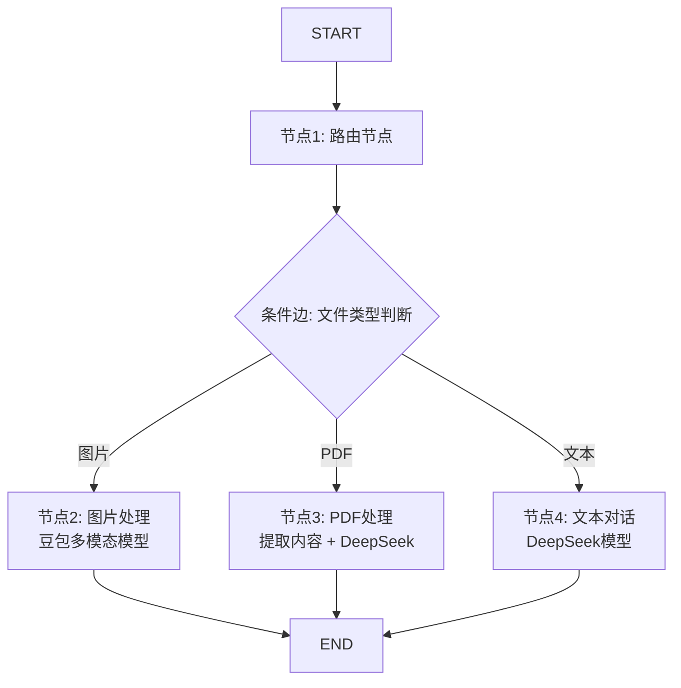

# 多模态对话系统

一个基于 LangGraph 的智能多模态对话系统，能够自动识别并处理图片、PDF文档和纯文本对话。

## 📋 目录

- [功能特性](#功能特性)
- [系统架构](#系统架构)
- [技术栈](#技术栈)
- [快速开始](#快速开始)
- [安装依赖](#安装依赖)
- [使用示例](#使用示例)
- [API文档](#api文档)
- [常见问题](#常见问题)

## ✨ 功能特性

### 1. 智能文件类型识别
- 自动检测用户上传的文件类型（图片/PDF/纯文本）
- 基于消息内容的智能路由

### 2. 多模态处理能力
- **图片对话**：使用豆包（Doubao）多模态模型处理图片相关问题
- **PDF文档对话**：自动提取PDF文本内容，使用DeepSeek模型回答问题
- **纯文本对话**：使用DeepSeek模型进行常规对话

### 3. PDF高级处理
- 支持base64编码的PDF数据
- 使用 `langchain-pymupdf4llm` 提取PDF文本内容（Markdown格式）
- 自动将PDF内容与用户问题结合
- 支持包含图片、流程图的PDF文档

### 4. 基于LangGraph的工作流
- 清晰的节点和边定义
- 条件路由自动选择处理路径
- 易于扩展和维护

## 🏗️ 系统架构

### 工作流结构

```
START 
  ↓
节点1: 路由节点（检测文件类型）
  ↓
条件边（根据文件类型路由）
  ├─→ 节点2: 图片处理节点（豆包多模态模型）→ END
  ├─→ 节点3: PDF处理节点（DeepSeek模型）→ END
  └─→ 节点4: 文本对话节点（DeepSeek模型）→ END
```

### 节点说明

#### 节点1：路由节点 (route_node)
- **功能**：检测用户上传的文件类型
- **输入**：用户消息
- **输出**：文件类型标识（image/pdf/text）

#### 节点2：图片处理节点 (image_processing_node)
- **功能**：处理图片相关对话
- **使用模型**：豆包多模态模型
- **适用场景**：图片描述、图片问答、视觉理解

#### 节点3：PDF处理节点 (pdf_processing_node)
- **功能**：提取PDF内容并回答问题
- **处理步骤**：
  1. 从消息中提取base64编码的PDF数据
  2. 解码并保存为临时文件
  3. 使用PyMuPDF4LLM提取文本内容
  4. 将提取的内容与用户问题组合
  5. 调用DeepSeek模型生成回答
- **使用模型**：DeepSeek

#### 节点4：文本对话节点 (text_processing_node)
- **功能**：处理纯文本对话
- **使用模型**：DeepSeek
- **适用场景**：常规问答、知识查询、任务执行

## 🛠️ 技术栈

- **LangChain**: 大语言模型应用框架
- **LangGraph**: 工作流编排框架
- **langchain-pymupdf4llm**: PDF文本提取
- **DeepSeek**: 文本对话模型
- **豆包（Doubao）**: 多模态模型
- **Python 3.12+**

## 📦 安装依赖

### 方法1：使用自动安装脚本（推荐）

**Windows PowerShell**：
```powershell
# 在项目根目录运行
.\install_dependencies.ps1
```

**Windows CMD**：
```cmd
# 在项目根目录运行
install_dependencies.bat
```

### 方法2：手动安装

**⚠️ 重要：必须使用虚拟环境的Python安装**

```bash
# 方式1：直接使用虚拟环境的Python（推荐）
E:\huitest004\.venv\Scripts\python.exe -m pip install langchain langchain-core langgraph langchain-pymupdf4llm langchain-deepseek langchain-openai -i https://pypi.tuna.tsinghua.edu.cn/simple

# 方式2：先激活虚拟环境，再安装
.\.venv\Scripts\Activate.ps1  # PowerShell
# 或
.venv\Scripts\activate.bat    # CMD

# 然后安装
pip install langchain langchain-core langgraph langchain-pymupdf4llm langchain-deepseek langchain-openai -i https://pypi.tuna.tsinghua.edu.cn/simple
```

### 验证安装

```bash
# 检查包是否安装到虚拟环境（Location应该指向.venv）
E:\huitest004\.venv\Scripts\python.exe -m pip show langchain-pymupdf4llm

# 应该看到：Location: E:\huitest004\.venv\Lib\site-packages
```

## 🚀 快速开始

### 1. 使用预构建的agent（推荐）

```python
from file_rag.main import agent  # 直接导入预构建的agent
from langchain_core.messages import HumanMessage

# 纯文本对话
result = agent.invoke({
    "messages": [HumanMessage(content="你好")],
    "file_type": "",
    "extracted_content": ""
})
print(result['messages'][-1].content)
```

### 2. 手动构建工作流

```python
from file_rag.main import build_multimodal_workflow
from langchain_core.messages import HumanMessage

# 构建工作流
app = build_multimodal_workflow()

# 纯文本对话
messages = [HumanMessage(content="你好，请介绍一下Python")]
result = app.invoke({
    "messages": messages,
    "file_type": "",
    "extracted_content": ""
})

print(result['messages'][-1].content)
```

### 2. 运行程序

```bash
# 进入src目录
cd src

# 运行主程序（包含文本对话测试）
python -m file_rag.main
```

## 📖 使用示例

### 场景1：纯文本对话

```python
from langchain_core.messages import HumanMessage

messages = [
    HumanMessage(content="什么是机器学习？")
]

result = app.invoke({
    "messages": messages,
    "file_type": "",
    "extracted_content": ""
})
```

### 场景2：图片对话

```python
import base64

# 读取图片并转换为base64
with open('image.jpg', 'rb') as f:
    image_data = base64.b64encode(f.read()).decode('utf-8')

messages = [
    HumanMessage(content=[
        {'type': 'text', 'text': '这张图片里有什么？'},
        {
            'type': 'image_url',
            'image_url': {
                'url': f'data:image/jpeg;base64,{image_data}'
            }
        }
    ])
]

result = app.invoke({
    "messages": messages,
    "file_type": "",
    "extracted_content": ""
})
```

### 场景3：PDF文档对话

```python
import base64

# 读取PDF并转换为base64
with open('document.pdf', 'rb') as f:
    pdf_data = base64.b64encode(f.read()).decode('utf-8')

messages = [
    HumanMessage(content=[
        {'type': 'text', 'text': '总结一下这个PDF的主要内容'},
        {
            'type': 'file',
            'source_type': 'base64',
            'mime_type': 'application/pdf',
            'data': pdf_data,
            'metadata': {'filename': 'document.pdf'}
        }
    ])
]

result = app.invoke({
    "messages": messages,
    "file_type": "",
    "extracted_content": ""
})
```

## 🔄 工作流程图



## 📚 API文档

### 核心函数

#### `build_multimodal_workflow()`
构建并返回编译后的多模态对话工作流。

**返回值**：
- `CompiledStateGraph`: 编译后的工作流应用

**示例**：
```python
app = build_multimodal_workflow()
```

#### `extract_pdf_content(base64_data: str) -> str`
从base64编码的PDF数据中提取文本内容。

**参数**：
- `base64_data` (str): base64编码的PDF数据

**返回值**：
- `str`: 提取的文本内容（Markdown格式）

#### `detect_file_type(messages: list[BaseMessage]) -> str`
检测消息中的文件类型。

**参数**：
- `messages` (list[BaseMessage]): 消息列表

**返回值**：
- `str`: 文件类型 ("image", "pdf", "text")

### 状态定义

```python
class ConversationState(TypedDict):
    messages: list[BaseMessage]  # 消息历史
    file_type: str              # 文件类型
    extracted_content: str      # 从PDF提取的内容
```

## 🔧 配置说明

### 1. LangGraph Server 配置（graph.json）

在项目根目录的 `graph.json` 中配置agent：

```json
{
  "dependencies": ["."],
  "graphs": {
    "agent": {
      "path": "./src/file_rag/main.py:agent"
    }
  },
  "env": ".env",
  "image_distro": "wolfi"
}
```

**说明**：
- `path`: 指向 `main.py` 中导出的 `agent` 变量
- `agent` 是预构建的 `CompiledStateGraph` 对象
- 可以直接被 LangGraph Server 或其他服务调用

**使用示例**：
```python
# 直接导入预构建的agent
from file_rag.main import agent

# 调用agent
result = agent.invoke({
    "messages": [HumanMessage(content="你好")],
    "file_type": "",
    "extracted_content": ""
})
```

### 2. 模型配置

在 `src/file_rag/core/llms.py` 中配置：

```python
# DeepSeek配置
os.environ["DEEPSEEK_API_KEY"] = "your-api-key"

# 豆包配置
def get_doubao_seed_model():
    return ChatOpenAI(
        model="doubao-seed-1-6-251015",
        base_url="https://ark.cn-beijing.volces.com/api/v3",
        api_key="your-api-key"
    )
```

## 🎯 最佳实践

1. **PDF文件大小**：建议单个PDF文件不超过10MB
2. **图片格式**：支持JPEG、PNG等常见格式
3. **错误处理**：系统会自动处理PDF提取失败的情况
4. **性能优化**：大文件建议先进行分块处理

## ❓ 常见问题

### Q1: 如何处理大型PDF文件？
**A**: 对于大型PDF（>10MB），建议：
1. 先提取PDF内容到文本文件
2. 对文本进行分块处理
3. 分别处理每个块并汇总结果

### Q2: 支持哪些图片格式？
**A**: 支持常见的图片格式：JPEG (.jpg, .jpeg)、PNG (.png)、GIF (.gif)、BMP (.bmp)

### Q3: 如何查看提取的PDF内容？
**A**: 可以从返回结果中获取：
```python
result = app.invoke({...})
extracted_content = result.get('extracted_content', '')
print(extracted_content)
```

### Q4: 多轮对话如何保持上下文？
**A**: 使用完整的消息历史：
```python
# 第一轮
result1 = app.invoke({"messages": [msg1], ...})

# 第二轮 - 使用result1的messages
result2 = app.invoke({
    "messages": result1['messages'] + [msg2],
    ...
})
```

### Q5: 运行时提示找不到模块？
**A**: 确保在 `src` 目录下运行，或者使用 `-m` 参数：
```bash
cd src
python -m file_rag.main
```

### Q6: PDF提取失败怎么办？
**A**: 检查：
- PDF文件是否损坏
- 文件路径是否正确
- base64编码是否正确
- 临时文件权限

### Q7: 模型调用失败？
**A**: 检查：
- API密钥是否正确配置
- 网络连接是否正常
- 模型服务状态

### Q8: IDE显示导入错误（红色波浪线）？
**A**: 这是IDE配置问题，不是代码问题。

**原因**：
- ✅ 包已正确安装，程序可以正常运行
- ❌ IDE使用了错误的Python解释器（全局Python而非虚拟环境）

**解决步骤**：

**步骤1：确保包安装到虚拟环境**
```bash
# 检查包位置
E:\huitest004\.venv\Scripts\python.exe -m pip show langchain-pymupdf4llm

# 如果Location不是指向.venv，重新安装
E:\huitest004\.venv\Scripts\python.exe -m pip install langchain-pymupdf4llm -i https://pypi.tuna.tsinghua.edu.cn/simple
```

**步骤2：配置IDE使用虚拟环境**
- **VSCode**: 按 `Ctrl+Shift+P` → `Python: Select Interpreter` → 选择 `.venv\Scripts\python.exe`
- **PyCharm**: `File` → `Settings` → `Python Interpreter` → 选择 `.venv\Scripts\python.exe`

**步骤3：重启IDE**
- VSCode: `Ctrl+Shift+P` → `Developer: Reload Window`
- PyCharm: 关闭并重新打开

**快速安装所有依赖**：运行项目根目录的 `install_dependencies.ps1` 或 `install_dependencies.bat`

## 📝 更新日志

### v1.0.0 (2025-11-07)
- ✨ 初始版本发布
- ✅ 支持图片、PDF、文本三种模态
- ✅ 基于LangGraph的智能路由
- ✅ 完整的文档和注释

## 📄 许可证

MIT License

---

**项目状态**: ✅ 已完成并通过测试
**最后更新**: 2025-11-07
