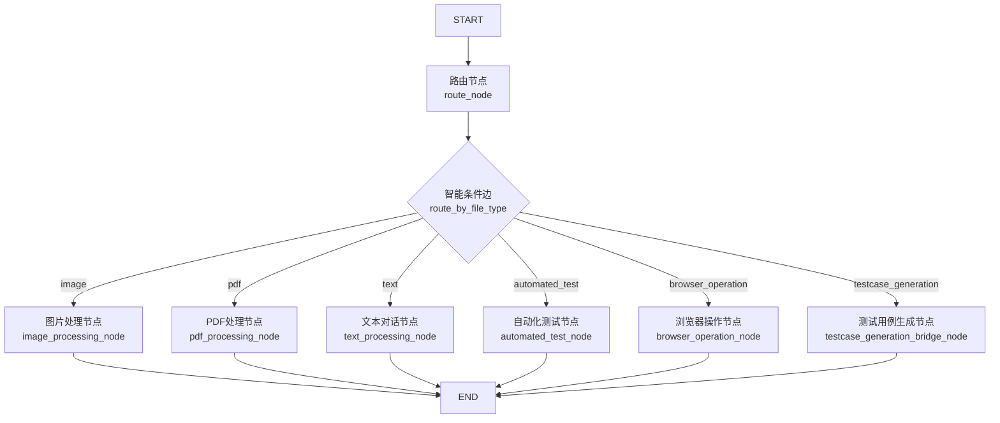

# 智能测试平台 - 项目说明文档

## 📋 目录

- [项目概述](#项目概述)
- [核心功能](#核心功能)
- [技术架构](#技术架构)
- [模块说明](#模块说明)
- [工作流详解](#工作流详解)
- [API文档](#api文档)
- [配置说明](#配置说明)
- [使用指南](#使用指南)
- [开发指南](#开发指南)

---

## 📖 项目概述

### 项目简介

这是一个基于 **LangGraph** 和大语言模型构建的企业级智能测试平台，集成了多模态对话、自动化测试、测试用例生成等功能。系统采用模块化设计，支持图片、PDF、文本等多种输入方式，能够智能识别用户意图并路由到相应的处理节点。

### 核心特性

✅ **智能路由系统** - 基于优先级的任务检测和自动路由  
✅ **多模态支持** - 支持图片、PDF文档、纯文本输入  
✅ **自动化测试** - 集成 Chrome MCP 工具执行浏览器自动化测试  
✅ **测试用例生成** - AI 驱动的测试用例生成和人工评审流程  
✅ **图表可视化** - 自动生成测试结果统计图表  
✅ **模块化架构** - 清晰的代码组织，易于维护和扩展  

### 技术栈

| 技术 | 版本 | 用途 |
|------|------|------|
| **LangGraph** | latest | 工作流编排框架 |
| **LangChain** | latest | LLM 应用开发框架 |
| **DeepSeek** | deepseek-chat | 主要推理模型（文本） |
| **Doubao (豆包)** | doubao-seed-1-6-251015 | 多模态模型（图片识别） |
| **MCP (Model Context Protocol)** | latest | 工具集成协议 |
| **PyMuPDF4LLM** | latest | PDF 文本提取 |
| **PyMuPDF (fitz)** | latest | PDF 图片提取 |
| **AntV Chart MCP** | latest | 图表生成服务 |
| **Chrome MCP** | latest | 浏览器自动化工具 |
| **Python** | 3.12+ | 开发语言 |

---

## 🎯 核心功能

### 1. 智能路由系统

系统能够自动检测用户输入的类型和意图，并路由到相应的处理节点：

**路由优先级**（从高到低）：
1. **文件类型检测** - 检测是否上传了图片或 PDF 文件
2. **测试用例生成** - 检测是否包含"编写测试用例"等关键词
3. **自动化测试** - 检测是否包含"测试"+"打开网站"等关键词
4. **浏览器操作** - 检测是否包含"打开网站"但无测试关键词
5. **普通对话** - 默认路由到文本对话节点

**支持的路由目标**：
- `image` - 图片处理节点
- `pdf` - PDF 处理节点
- `testcase_generation` - 测试用例生成节点
- `automated_test` - 自动化测试节点
- `browser_operation` - 浏览器操作节点
- `text` - 文本对话节点

### 2. 多模态对话

#### 图片对话
- **模型**：豆包多模态模型 (Doubao)
- **功能**：图片描述、图片问答、视觉理解
- **输入格式**：base64 编码的图片数据
- **支持格式**：JPEG、PNG、GIF、BMP

#### PDF 文档对话
- **处理流程**：
  1. 提取 PDF 文本内容（使用 PyMuPDF4LLM）
  2. 提取 PDF 中的图片（使用 PyMuPDF）
  3. 使用豆包模型识别图片内容
  4. 将文本和图片识别结果组合
  5. 使用 DeepSeek 模型生成最终回答
- **模型**：DeepSeek（文本）+ Doubao（图片识别）
- **输出格式**：Markdown 格式

#### 纯文本对话
- **模型**：DeepSeek
- **功能**：常规问答、知识查询、任务执行
- **特点**：支持多轮对话，保持上下文

### 3. 自动化测试

#### 功能特性
- **工具集成**：使用 Chrome MCP 工具执行浏览器操作
- **测试执行**：自动化执行登录、表单填写、点击等操作
- **结果收集**：收集测试执行结果和截图
- **报告生成**：生成详细的 Markdown 格式测试报告
- **图表可视化**：自动生成测试结果统计图表

#### 工作流程
1. 分析用户测试需求
2. 使用 ReAct Agent + MCP Chrome 工具执行测试
3. 收集测试执行结果
4. 生成详细测试报告
5. 生成测试结果可视化图表（可选）

#### 支持的操作
- `chrome_navigate` - 打开网页
- `chrome_get_web_content` - 获取网页内容
- `chrome_click_element` - 点击元素
- `chrome_fill_or_select` - 填写表单
- `chrome_get_interactive_elements` - 获取可交互元素
- `chrome_screenshot` - 截图

### 4. 测试用例生成

#### 人工评审流程
1. **生成测试用例** - AI 根据需求生成结构化测试用例
2. **等待评审** - 系统暂停，等待用户评审
3. **评审反馈**：
   - 回复"通过" → 保存测试用例到 Excel
   - 回复"不通过 + 反馈意见" → 根据反馈重新生成
4. **迭代优化** - 支持多轮评审和改进

#### 测试用例格式
每个测试用例包含以下字段：
- **用例编号**：TC001, TC002...
- **用例标题**：简洁明了的标题
- **前置条件**：执行测试前需要满足的条件
- **测试步骤**：详细的操作步骤（每步一行）
- **预期结果**：期望的测试结果
- **优先级**：高/中/低

#### 支持的输入方式
- **纯文本** - 直接描述测试需求
- **图片** - 上传界面截图，AI 识别后生成测试用例
- **PDF** - 上传需求文档，AI 提取内容后生成测试用例

### 5. 浏览器操作

#### 功能说明
- **用途**：执行简单的浏览器操作，不生成测试报告
- **与自动化测试的区别**：
  - 自动化测试：生成详细的测试报告和图表
  - 浏览器操作：只执行操作并返回结果

#### 使用场景
- 打开网站并搜索信息
- 访问特定页面并获取内容
- 执行简单的页面交互

### 6. 图表可视化

#### 功能特性
- **服务**：AntV Chart MCP 服务
- **图表类型**：柱状图、饼图、折线图
- **自动生成**：根据测试结果自动生成统计图表
- **嵌入方式**：将图表转换为 base64 嵌入 Markdown

#### 生成流程
1. 分析测试报告，提取统计数据
2. 调用 AntV Chart MCP 工具生成图表
3. 下载图表图片并转换为 base64
4. 嵌入到测试报告中

---

## 🏗️ 技术架构

### 整体架构

```
┌─────────────────────────────────────────────────────────────┐
│                      LangGraph Server                        │
│                    (graph.json 配置)                         │
└─────────────────────────────────────────────────────────────┘
                              │
                              ▼
┌─────────────────────────────────────────────────────────────┐
│                    多模态对话工作流                          │
│                 (StateGraph Workflow)                        │
│                                                               │
│  START → 路由节点 → 智能条件边 → [处理节点] → END          │
└─────────────────────────────────────────────────────────────┘
                              │
        ┌─────────────────────┼─────────────────────┐
        ▼                     ▼                     ▼
┌──────────────┐    ┌──────────────┐    ┌──────────────┐
│  图片处理    │    │  PDF处理     │    │  文本对话    │
│  (Doubao)    │    │(DeepSeek+    │    │ (DeepSeek)   │
│              │    │  Doubao)     │    │              │
└──────────────┘    └──────────────┘    └──────────────┘
        │                     │                     │
        ▼                     ▼                     ▼
┌──────────────┐    ┌──────────────┐    ┌──────────────┐
│ 自动化测试   │    │ 浏览器操作   │    │ 测试用例生成 │
│(DeepSeek+MCP)│    │(DeepSeek+MCP)│    │(DeepSeek+    │
│              │    │              │    │  人工评审)   │
└──────────────┘    └──────────────┘    └──────────────┘
```

### 工作流结构



### 数据流

```
用户输入 (messages)
    ↓
路由节点 (检测类型)
    ↓
ConversationState (状态更新)
    ↓
条件边 (路由决策)
    ↓
处理节点 (执行任务)
    ↓
ConversationState (结果更新)
    ↓
返回结果 (messages + extracted_content)
```

---

## 📦 模块说明

### 目录结构

```
src/file_rag/
├── main.py                          # 主入口文件 (62行)
├── mcp_config.py                    # MCP 服务配置 (80行)
├── MCP_INTEGRATION.md               # MCP 集成文档
├── README.md                        # 项目说明
│
├── core/                            # 核心模块
│   └── llms.py                      # LLM 模型配置 (26行)
│
├── models/                          # 数据模型
│   ├── __init__.py                  # 模型导出
│   └── state.py                     # 状态定义 (36行)
│
├── utils/                           # 工具函数
│   ├── __init__.py                  # 工具导出
│   ├── mcp_tools.py                 # MCP 工具加载 (138行)
│   ├── pdf_utils.py                 # PDF 处理 (124行)
│   ├── chart_utils.py               # 图表生成 (164行)
│   └── detection.py                 # 任务检测 (335行)
│
├── nodes/                           # 工作流节点
│   ├── __init__.py                  # 节点导出
│   ├── route_node.py                # 路由节点 (57行)
│   ├── image_node.py                # 图片处理 (54行)
│   ├── pdf_node.py                  # PDF 处理 (157行)
│   ├── text_node.py                 # 文本对话 (54行)
│   ├── automated_test_node.py       # 自动化测试 (230行)
│   ├── browser_node.py              # 浏览器操作 (163行)
│   └── testcase_nodes.py            # 测试用例生成 (412行)
│
└── workflows/                       # 工作流构建
    ├── __init__.py                  # 工作流导出
    └── multimodal_workflow.py       # 多模态工作流 (168行)
```

### 核心模块详解

#### 1. main.py - 主入口

**功能**：导出预构建的 agent 供 LangGraph Server 使用

**代码**：
```python
from file_rag.workflows import build_multimodal_workflow

# 创建全局 agent 实例
agent = build_multimodal_workflow()
```

**说明**：
- 只有 62 行代码（重构前 2570 行）
- 导出的 `agent` 可直接被 LangGraph Server 调用
- 在 `graph.json` 中配置为 `./src/file_rag/main.py:agent`

#### 2. mcp_config.py - MCP 配置

**功能**：集中管理 MCP 服务配置

**配置项**：
```python
MCP_SERVERS = {
    "chrome_mcp": {
        "enabled": True,
        "url": "http://127.0.0.1:12306/mcp",
        "transport": "streamable_http",
        "description": "Chrome 浏览器自动化"
    },
    "chart_mcp": {
        "enabled": True,
        "command": "npx",
        "args": ["-y", "@antv/mcp-server-chart"],
        "transport": "stdio",
        "description": "图表生成服务"
    }
}
```

**全局设置**：
```python
MCP_SETTINGS = {
    "enable_mcp": True,      # 全局开关
    "fail_silently": True,   # 失败时静默
    "timeout": 30            # 超时时间
}
```

#### 3. core/llms.py - 模型配置

**功能**：配置和初始化 LLM 模型

**主要函数**：
```python
def get_default_model():
    """获取默认模型（DeepSeek）"""
    return ChatDeepSeek(model="deepseek-chat", verbose=False)

def get_doubao_seed_model():
    """获取豆包多模态模型"""
    return ChatOpenAI(
        model="doubao-seed-1-6-251015",
        base_url="https://ark.cn-beijing.volces.com/api/v3",
        api_key="9c18584a-dbec-4496-af23-ef0bb31480dd"
    )
```

**模型选择**：
- **DeepSeek**：用于文本推理、测试用例生成、报告生成
- **Doubao**：用于图片识别、PDF 图片内容提取

#### 4. models/state.py - 状态定义

**ConversationState**：主工作流状态
```python
class ConversationState(TypedDict, total=False):
    messages: list[BaseMessage]           # 消息历史
    file_type: str                        # 文件类型
    extracted_content: str                # 提取的内容
    test_requirement: str                 # 测试需求
    test_cases: str                       # 生成的测试用例
    test_review_result: str               # 评审结果
    test_review_count: int                # 评审次数
    test_review_feedback: str             # 评审反馈
    waiting_for_user_review: bool         # 是否等待评审
    original_analysis: str                # 原始分析结果
    used_multimodal: bool                 # 是否使用多模态
```

**设计说明**：
- 使用 `total=False` 使所有字段可选
- 支持向后兼容
- 便于状态扩展

#### 5. utils/mcp_tools.py - MCP 工具加载

**主要函数**：

**`get_all_mcp_tools()`** - 加载所有 MCP 工具
```python
async def get_all_mcp_tools() -> list:
    """异步加载所有可用的 MCP 工具"""
    all_tools = []
    mcp_tools = await get_mcp_tools_from_config()
    all_tools.extend(mcp_tools)
    return all_tools
```

**`get_chart_mcp_tools()`** - 单独加载图表工具
```python
async def get_chart_mcp_tools() -> list:
    """单独加载图表 MCP 工具"""
    # 只加载 AntV Chart MCP 服务
    chart_config = {
        "chart_mcp": {
            "command": "npx",
            "args": ["-y", "@antv/mcp-server-chart"],
            "transport": "stdio"
        }
    }
    client = MultiServerMCPClient(chart_config)
    tools = await client.get_tools()
    return tools
```

**特点**：
- 异步加载，不阻塞主流程
- 失败时优雅降级
- 详细的日志输出

#### 6. utils/pdf_utils.py - PDF 处理

**主要函数**：

**`extract_pdf_content()`** - 提取 PDF 文本
```python
def extract_pdf_content(base64_data: str) -> str:
    """从 base64 编码的 PDF 数据中提取文本内容"""
    # 1. 解码 base64 数据
    # 2. 创建临时文件
    # 3. 使用 PyMuPDF4LLM 提取文本
    # 4. 返回 Markdown 格式内容
```

**`extract_pdf_images()`** - 提取 PDF 图片
```python
def extract_pdf_images(base64_data: str) -> list:
    """从 base64 编码的 PDF 数据中提取所有图片"""
    # 1. 解码 base64 数据
    # 2. 使用 PyMuPDF (fitz) 打开 PDF
    # 3. 遍历每一页提取图片
    # 4. 返回图片列表（base64 编码）
```

**返回格式**：
```python
[
    {
        'page': 1,              # 页码
        'index': 1,             # 图片索引
        'data': 'base64...',    # base64 编码的图片数据
        'ext': 'png'            # 图片格式
    }
]
```

#### 7. utils/chart_utils.py - 图表生成

**主要函数**：

**`generate_test_result_chart()`** - 生成测试结果图表
```python
async def generate_test_result_chart(
    test_execution_result: str,
    test_report: str
) -> str:
    """根据测试执行结果生成图表"""
    # 1. 加载 Chart MCP 工具
    # 2. 创建 ReAct Agent
    # 3. 分析测试报告，提取统计数据
    # 4. 调用 create_chart 工具生成图表
    # 5. 下载图表并转换为 base64
    # 6. 返回嵌入式 Markdown 图片
```

**处理流程**：
1. 使用 DeepSeek 分析测试报告
2. 提取通过/失败/跳过的数量
3. 调用 AntV Chart MCP 生成图表
4. 从返回的 URL 下载图片
5. 转换为 base64 嵌入 Markdown

**图表类型**：
- 柱状图（bar）
- 饼图（pie）
- 折线图（line）

#### 8. utils/detection.py - 任务检测

**主要函数**：

**`detect_file_type()`** - 智能检测消息类型
```python
def detect_file_type(messages: list) -> str:
    """
    智能检测消息类型和路由目标

    优先级：
    1. 检测文件类型（图片、PDF）
    2. 检测是否是测试用例生成任务
    3. 检测是否是自动化测试任务
    4. 检测是否是浏览器操作任务
    5. 默认为普通文本对话
    """
```

**`detect_test_case_generation_task()`** - 检测测试用例生成
```python
def detect_test_case_generation_task(messages: list) -> bool:
    """
    检测是否是测试用例生成任务

    特征：
    - 包含"编写"、"生成"、"创建"等关键词
    - 包含"测试用例"、"用例"等关键词
    - 不包含"执行"、"运行"等自动化执行关键词
    """
```

**`detect_automated_test_task()`** - 检测自动化测试
```python
def detect_automated_test_task(messages: list) -> bool:
    """
    检测是否是自动化测试任务

    特征（必须同时满足）：
    - 包含"测试"、"自动化"、"测试报告"等关键词
    - 包含"打开"、"访问"、"登录"等操作词 OR 包含网址
    """
```

**`detect_browser_operation_task()`** - 检测浏览器操作
```python
def detect_browser_operation_task(messages: list) -> bool:
    """
    检测是否是浏览器操作任务

    特征：
    - 包含"打开"、"访问"、"搜索"等操作词
    - 包含网址或域名
    - 不包含"测试"关键词
    """
```

---

## 🔄 工作流详解

### 1. 路由节点 (route_node)

**文件**：`src/file_rag/nodes/route_node.py`

**功能**：
- 检测用户消息类型
- 决定路由目标
- 更新状态中的 `file_type` 字段

**处理逻辑**：
```python
def route_node(state: ConversationState) -> ConversationState:
    # 1. 检查是否正在等待用户评审
    if waiting_for_review and test_cases:
        file_type = "testcase_generation"
    else:
        # 2. 调用 detect_file_type 检测类型
        file_type = detect_file_type(messages)

    # 3. 更新状态
    return {**state, "file_type": file_type}
```

**输出**：
- `file_type`: "image" | "pdf" | "text" | "testcase_generation" | "automated_test" | "browser_operation"

### 2. 图片处理节点 (image_processing_node)

**文件**：`src/file_rag/nodes/image_node.py`

**功能**：
- 使用豆包多模态模型处理图片对话
- 过滤消息（只保留 human/ai/system 类型）
- 返回 AI 回复

**处理流程**：
```python
def image_processing_node(state: ConversationState) -> ConversationState:
    # 1. 过滤消息（移除 tool 类型）
    filtered_messages = [msg for msg in messages if msg.type in ['human', 'ai', 'system']]

    # 2. 调用豆包多模态模型
    model = get_doubao_seed_model()
    response = model.invoke(filtered_messages)

    # 3. 更新消息历史
    updated_messages = messages + [response]

    return {**state, "messages": updated_messages}
```

**使用场景**：
- 图片描述："这张图片里有什么？"
- 图片问答："图片中的文字是什么？"
- 视觉理解："分析这张流程图"

### 3. PDF 处理节点 (pdf_processing_node)

**文件**：`src/file_rag/nodes/pdf_node.py`

**功能**：
- 提取 PDF 文本内容
- 提取 PDF 中的图片
- 使用豆包模型识别图片内容
- 组合所有内容后使用 DeepSeek 生成回答

**处理流程**：
```python
def pdf_processing_node(state: ConversationState) -> ConversationState:
    # 步骤1：提取 PDF 文本内容
    extracted_text = extract_pdf_content(pdf_base64_data)

    # 步骤2：提取 PDF 图片
    extracted_images = extract_pdf_images(pdf_base64_data)

    # 步骤3：使用豆包模型识别图片
    doubao_model = get_doubao_seed_model()
    for img_info in extracted_images:
        description = doubao_model.invoke([image_message])
        image_descriptions.append(description)

    # 步骤4：组合所有内容
    combined_content = f"""
    【文本内容】
    {extracted_text}

    【图片内容】
    {image_descriptions}
    """

    # 步骤5：调用 DeepSeek 生成最终回答
    model = get_default_model()
    response = model.invoke([HumanMessage(content=combined_message)])

    return {**state, "messages": updated_messages, "extracted_content": combined_content}
```

**优势**：
- 同时处理文本和图片
- 完整提取 PDF 内容
- 适合复杂的 PDF 文档

### 4. 文本对话节点 (text_processing_node)

**文件**：`src/file_rag/nodes/text_node.py`

**功能**：
- 使用 DeepSeek 模型处理纯文本对话
- 过滤消息（只保留 human/ai/system 类型）
- 支持多轮对话

**处理流程**：
```python
def text_processing_node(state: ConversationState) -> ConversationState:
    # 1. 过滤消息
    filtered_messages = [msg for msg in messages if msg.type in ['human', 'ai', 'system']]

    # 2. 调用 DeepSeek 模型
    model = get_default_model()
    response = model.invoke(filtered_messages)

    # 3. 更新消息历史
    updated_messages = messages + [response]

    return {**state, "messages": updated_messages}
```

**使用场景**：
- 常规问答
- 知识查询
- 任务执行

### 5. 自动化测试节点 (automated_test_node)

**文件**：`src/file_rag/nodes/automated_test_node.py`

**功能**：
- 使用 DeepSeek + MCP Chrome 工具执行自动化测试
- 生成详细测试报告
- 生成测试结果可视化图表

**处理流程**：
```python
async def automated_test_node(state: ConversationState) -> ConversationState:
    # 步骤1：检查 MCP 工具是否可用
    mcp_tools = await get_all_mcp_tools()
    if not mcp_tools:
        return error_response

    # 步骤2：使用 ReAct Agent + MCP 工具执行测试
    test_agent = create_react_agent(model, mcp_tools)
    agent_result = await test_agent.ainvoke(
        {"messages": [HumanMessage(content=execution_prompt)]},
        config={"recursion_limit": 50}
    )

    # 步骤3：生成详细测试报告
    report_response = model.invoke([HumanMessage(content=report_prompt)])
    final_report = report_response.content

    # 步骤4：生成测试结果图表（可选）
    chart_html = await generate_test_result_chart(test_execution_result, final_report)

    # 步骤5：组合报告和图表
    final_report_with_chart = f"{final_report}\n\n{chart_html}"

    return {**state, "messages": updated_messages, "extracted_content": test_execution_result}
```

**测试报告格式**：
```markdown
# 自动化测试报告

## 测试概述
测试目标和范围

## 测试环境
测试网站和工具

## 测试用例
列出所有测试用例

## 测试执行详情
每个测试用例的执行步骤和结果

## 测试结果统计
通过/失败的统计

## 📊 测试结果可视化
[图表]

## 问题总结
发现的问题（如果有）

## 结论和建议
测试结论和改进建议
```

**支持的测试场景**：
- 登录测试
- 表单填写测试
- 页面导航测试
- 元素交互测试

### 6. 浏览器操作节点 (browser_operation_node)

**文件**：`src/file_rag/nodes/browser_node.py`

**功能**：
- 使用 DeepSeek + MCP Chrome 工具执行浏览器操作
- 只执行操作并返回结果，不生成测试报告

**处理流程**：
```python
async def browser_operation_node(state: ConversationState) -> ConversationState:
    # 步骤1：检查 MCP 工具是否可用
    mcp_tools = await get_all_mcp_tools()
    if not mcp_tools:
        return error_response

    # 步骤2：使用 ReAct Agent + MCP 工具执行操作
    operation_agent = create_react_agent(model, mcp_tools)
    agent_result = await operation_agent.ainvoke(
        {"messages": [HumanMessage(content=execution_prompt)]},
        config={"recursion_limit": 50}
    )

    # 步骤3：提取操作结果
    operation_result = extract_final_result(agent_result)

    return {**state, "messages": updated_messages, "extracted_content": operation_result}
```

**与自动化测试的区别**：
| 特性 | 自动化测试 | 浏览器操作 |
|------|-----------|-----------|
| 生成测试报告 | ✅ | ❌ |
| 生成图表 | ✅ | ❌ |
| 详细步骤记录 | ✅ | ❌ |
| 快速执行 | ❌ | ✅ |

**使用场景**：
- "打开 www.baidu.com 搜索凤凰古城"
- "访问 https://www.google.com"
- "打开网站并获取标题"

### 7. 测试用例生成节点 (testcase_generation_bridge_node)

**文件**：`src/file_rag/nodes/testcase_nodes.py`

**功能**：
- 根据需求生成测试用例
- 支持人工评审流程
- 支持多轮迭代优化
- 保存测试用例到 Excel

**处理流程**：
```python
def testcase_generation_bridge_node(state: ConversationState) -> ConversationState:
    # 步骤1：检测是否是用户评审输入
    if waiting_for_review and test_cases:
        # 处理评审结果
        if "通过" in user_input:
            # 保存测试用例到 Excel
            save_test_cases_to_excel(test_cases, file_name)
            return success_response
        else:
            # 根据反馈重新生成
            new_test_cases = regenerate_with_feedback(feedback)
            return review_response

    # 步骤2：首次生成测试用例
    model = get_default_model()
    response = model.invoke([system_prompt, user_prompt])
    test_cases = response.content

    # 步骤3：等待用户评审
    return {
        **state,
        "messages": updated_messages,
        "test_cases": test_cases,
        "waiting_for_user_review": True
    }
```

**评审流程**：
```
生成测试用例
    ↓
等待用户评审
    ↓
用户回复 "通过" → 保存到 Excel → 完成
    ↓
用户回复 "不通过 + 反馈" → 重新生成 → 等待评审
```

**支持的输入方式**：
1. **纯文本**：直接描述需求
2. **图片**：上传界面截图，AI 识别后生成
3. **PDF**：上传需求文档，AI 提取后生成

**生成的测试用例格式**：
```
用例编号：TC001
用例标题：成功登录测试
前置条件：用户已注册，浏览器已打开登录页面
测试步骤：
  1. 输入正确的用户名
  2. 输入正确的密码
  3. 点击登录按钮
预期结果：成功登录，跳转到首页
优先级：高
```

---

## 📚 API 文档

### 主要函数

#### build_multimodal_workflow()

**功能**：构建多模态对话工作流

**签名**：
```python
def build_multimodal_workflow(enable_mcp: bool = True) -> CompiledStateGraph
```

**参数**：
- `enable_mcp` (bool): 是否启用 MCP 工具，默认 True

**返回值**：
- `CompiledStateGraph`: 编译后的工作流应用

**示例**：
```python
from file_rag.workflows import build_multimodal_workflow

# 启用 MCP
app = build_multimodal_workflow(enable_mcp=True)

# 禁用 MCP
app = build_multimodal_workflow(enable_mcp=False)
```

#### get_all_mcp_tools()

**功能**：异步加载所有可用的 MCP 工具

**签名**：
```python
async def get_all_mcp_tools() -> list
```

**返回值**：
- `list`: MCP 工具列表，如果加载失败则返回空列表

**示例**：
```python
from file_rag.utils.mcp_tools import get_all_mcp_tools

# 异步调用
mcp_tools = await get_all_mcp_tools()
print(f"加载了 {len(mcp_tools)} 个工具")
```

#### extract_pdf_content()

**功能**：从 base64 编码的 PDF 数据中提取文本内容

**签名**：
```python
def extract_pdf_content(base64_data: str) -> str
```

**参数**：
- `base64_data` (str): base64 编码的 PDF 数据

**返回值**：
- `str`: 提取的文本内容（Markdown 格式）

**示例**：
```python
from file_rag.utils.pdf_utils import extract_pdf_content
import base64

# 读取 PDF 文件
with open('document.pdf', 'rb') as f:
    pdf_bytes = f.read()
    pdf_base64 = base64.b64encode(pdf_bytes).decode('utf-8')

# 提取内容
content = extract_pdf_content(pdf_base64)
print(content)
```

#### extract_pdf_images()

**功能**：从 base64 编码的 PDF 数据中提取所有图片

**签名**：
```python
def extract_pdf_images(base64_data: str) -> list
```

**参数**：
- `base64_data` (str): base64 编码的 PDF 数据

**返回值**：
- `list`: 图片列表，每个图片包含 page、index、data、ext 字段

**示例**：
```python
from file_rag.utils.pdf_utils import extract_pdf_images

images = extract_pdf_images(pdf_base64)
for img in images:
    print(f"第 {img['page']} 页，第 {img['index']} 张图片，格式：{img['ext']}")
```

#### detect_file_type()

**功能**：智能检测消息类型和路由目标

**签名**：
```python
def detect_file_type(messages: list) -> str
```

**参数**：
- `messages` (list): 消息列表

**返回值**：
- `str`: 文件类型 ("image" | "pdf" | "text" | "testcase_generation" | "automated_test" | "browser_operation")

**示例**：
```python
from file_rag.utils.detection import detect_file_type
from langchain_core.messages import HumanMessage

messages = [HumanMessage(content="编写登录功能的测试用例")]
file_type = detect_file_type(messages)
print(file_type)  # 输出: testcase_generation
```

#### generate_test_result_chart()

**功能**：根据测试执行结果生成图表

**签名**：
```python
async def generate_test_result_chart(
    test_execution_result: str,
    test_report: str
) -> str
```

**参数**：
- `test_execution_result` (str): 测试执行结果
- `test_report` (str): 测试报告

**返回值**：
- `str`: 图表的 Markdown 代码，如果生成失败则返回空字符串

**示例**：
```python
from file_rag.utils.chart_utils import generate_test_result_chart

chart_html = await generate_test_result_chart(
    test_execution_result="...",
    test_report="..."
)
print(chart_html)
```

### 状态定义

#### ConversationState

**定义**：
```python
class ConversationState(TypedDict, total=False):
    messages: list[BaseMessage]           # 消息历史
    file_type: str                        # 文件类型
    extracted_content: str                # 提取的内容
    test_requirement: str                 # 测试需求
    test_cases: str                       # 生成的测试用例
    test_review_result: str               # 评审结果
    test_review_count: int                # 评审次数
    test_review_feedback: str             # 评审反馈
    waiting_for_user_review: bool         # 是否等待评审
    original_analysis: str                # 原始分析结果
    used_multimodal: bool                 # 是否使用多模态
```

**字段说明**：
- `messages`: 对话消息历史，包含用户消息和 AI 回复
- `file_type`: 检测到的文件类型，用于路由决策
- `extracted_content`: 从 PDF 或其他来源提取的内容
- `test_requirement`: 用户的测试需求描述
- `test_cases`: AI 生成的测试用例内容
- `test_review_result`: 用户的评审结果（通过/不通过）
- `test_review_count`: 评审迭代次数
- `test_review_feedback`: 用户的评审反馈意见
- `waiting_for_user_review`: 是否正在等待用户评审
- `original_analysis`: 原始的分析结果（用于重新生成）
- `used_multimodal`: 是否使用了多模态模型（图片/PDF）

---

## ⚙️ 配置说明

### 1. LangGraph Server 配置

**文件**：`graph.json`

**配置**：
```json
{
  "dependencies": ["."],
  "graphs": {
    "agent": {
      "path": "./src/file_rag/main.py:agent"
    }
  },
  "env": ".env",
  "image_distro": "wolfi"
}
```

**说明**：
- `path`: 指向 main.py 中导出的 agent 变量
- `agent` 是预构建的 CompiledStateGraph 对象
- 可以直接被 LangGraph Server 调用

### 2. MCP 服务配置

**文件**：`src/file_rag/mcp_config.py`

**Chrome MCP 配置**：
```python
"chrome_mcp": {
    "enabled": True,
    "url": "http://127.0.0.1:12306/mcp",
    "transport": "streamable_http",
    "description": "Chrome 浏览器自动化工具"
}
```

**Chart MCP 配置**：
```python
"chart_mcp": {
    "enabled": True,
    "command": "npx",
    "args": ["-y", "@antv/mcp-server-chart"],
    "transport": "stdio",
    "description": "图表生成服务（柱状图、饼图、折线图）"
}
```

**全局设置**：
```python
MCP_SETTINGS = {
    "enable_mcp": True,      # 全局开关
    "fail_silently": True,   # 失败时静默，不影响主功能
    "timeout": 30            # 超时时间（秒）
}
```

### 3. 模型配置

**文件**：`src/file_rag/core/llms.py`

**DeepSeek 配置**：
```python
# 需要设置环境变量
os.environ["DEEPSEEK_API_KEY"] = "your-api-key"

def get_default_model():
    return ChatDeepSeek(model="deepseek-chat", verbose=False)
```

**Doubao 配置**：
```python
def get_doubao_seed_model():
    return ChatOpenAI(
        model="doubao-seed-1-6-251015",
        base_url="https://ark.cn-beijing.volces.com/api/v3",
        api_key="9c18584a-dbec-4496-af23-ef0bb31480dd"
    )
```

### 4. 依赖配置

**文件**：`requirements.txt`

**核心依赖**：
```
langgraph
langchain[openai]
langchain-deepseek
langchain-mcp-adapters
langgraph-cli[inmem]
```

**安装命令**：
```bash
# 使用虚拟环境的 Python
.venv\Scripts\python.exe -m pip install -r requirements.txt
```

---

## 📖 使用指南

### 快速开始

#### 1. 安装依赖

```bash
# 克隆项目
cd E:\huitest004

# 安装 Python 依赖
.venv\Scripts\python.exe -m pip install -r requirements.txt

# 安装 MCP 适配器（可选）
.venv\Scripts\python.exe -m pip install langchain-mcp-adapters
```

#### 2. 配置环境变量

创建 `.env` 文件：
```bash
DEEPSEEK_API_KEY=your-deepseek-api-key
```

#### 3. 启动服务

```bash
# 启动 LangGraph Server
langgraph dev

# 或使用自定义启动脚本
python start_server.py
```

#### 4. 使用 Agent

**方法 1：直接导入**
```python
from file_rag.main import agent
from langchain_core.messages import HumanMessage

result = agent.invoke({
    "messages": [HumanMessage(content="你好")],
    "file_type": "",
    "extracted_content": ""
})
print(result['messages'][-1].content)
```

**方法 2：手动构建**
```python
from file_rag.workflows import build_multimodal_workflow
from langchain_core.messages import HumanMessage

app = build_multimodal_workflow()
result = app.invoke({
    "messages": [HumanMessage(content="你好")],
    "file_type": "",
    "extracted_content": ""
})
print(result['messages'][-1].content)
```

### 使用场景示例

#### 场景 1：纯文本对话

```python
from file_rag.main import agent
from langchain_core.messages import HumanMessage

# 普通问答
result = agent.invoke({
    "messages": [HumanMessage(content="什么是机器学习？")],
    "file_type": "",
    "extracted_content": ""
})

print(result['messages'][-1].content)
```

#### 场景 2：图片对话

```python
import base64
from langchain_core.messages import HumanMessage

# 读取图片
with open('screenshot.png', 'rb') as f:
    image_data = base64.b64encode(f.read()).decode('utf-8')

# 构建消息
messages = [
    HumanMessage(content=[
        {'type': 'text', 'text': '这张图片里有什么？'},
        {
            'type': 'image_url',
            'image_url': {
                'url': f'data:image/png;base64,{image_data}'
            }
        }
    ])
]

# 调用 agent
result = agent.invoke({
    "messages": messages,
    "file_type": "",
    "extracted_content": ""
})

print(result['messages'][-1].content)
```

#### 场景 3：PDF 文档对话

```python
import base64
from langchain_core.messages import HumanMessage

# 读取 PDF
with open('document.pdf', 'rb') as f:
    pdf_data = base64.b64encode(f.read()).decode('utf-8')

# 构建消息
messages = [
    HumanMessage(content=[
        {'type': 'text', 'text': '总结一下这个 PDF 的主要内容'},
        {
            'type': 'file',
            'source_type': 'base64',
            'mime_type': 'application/pdf',
            'data': pdf_data,
            'metadata': {'filename': 'document.pdf'}
        }
    ])
]

# 调用 agent
result = agent.invoke({
    "messages": messages,
    "file_type": "",
    "extracted_content": ""
})

print(result['messages'][-1].content)
print(f"\n提取的内容：\n{result.get('extracted_content', '')}")
```

#### 场景 4：测试用例生成

**纯文本输入**：
```python
from langchain_core.messages import HumanMessage

messages = [
    HumanMessage(content="请为用户登录功能编写测试用例，包括正常登录、错误密码、空用户名等场景")
]

result = agent.invoke({
    "messages": messages,
    "file_type": "",
    "extracted_content": ""
})

print(result['messages'][-1].content)
```

**图片输入**：
```python
import base64
from langchain_core.messages import HumanMessage

# 读取界面截图
with open('login_page.png', 'rb') as f:
    image_data = base64.b64encode(f.read()).decode('utf-8')

messages = [
    HumanMessage(content=[
        {'type': 'text', 'text': '请根据这张登录页面截图编写测试用例'},
        {
            'type': 'image_url',
            'image_url': {
                'url': f'data:image/png;base64,{image_data}'
            }
        }
    ])
]

result = agent.invoke({
    "messages": messages,
    "file_type": "",
    "extracted_content": ""
})

print(result['messages'][-1].content)
```

**人工评审流程**：
```python
# 第一轮：生成测试用例
result1 = agent.invoke({
    "messages": [HumanMessage(content="编写登录功能的测试用例")],
    "file_type": "",
    "extracted_content": ""
})
print(result1['messages'][-1].content)

# 第二轮：评审不通过，提供反馈
result2 = agent.invoke({
    "messages": result1['messages'] + [
        HumanMessage(content="不通过，需要增加边界场景的测试用例")
    ],
    "file_type": "",
    "extracted_content": ""
})
print(result2['messages'][-1].content)

# 第三轮：评审通过
result3 = agent.invoke({
    "messages": result2['messages'] + [
        HumanMessage(content="通过")
    ],
    "file_type": "",
    "extracted_content": ""
})
print(result3['messages'][-1].content)
```

#### 场景 5：自动化测试

```python
from langchain_core.messages import HumanMessage

messages = [
    HumanMessage(content="""
    请对 https://www.saucedemo.com/ 网站执行以下自动化测试：
    1. 使用正确的用户名和密码登录
    2. 验证登录成功
    3. 使用错误的密码登录
    4. 验证错误提示

    生成详细的测试报告和图表
    """)
]

# 注意：这是异步函数，需要在异步环境中调用
import asyncio

async def run_test():
    result = await agent.ainvoke({
        "messages": messages,
        "file_type": "",
        "extracted_content": ""
    })
    print(result['messages'][-1].content)

asyncio.run(run_test())
```

#### 场景 6：浏览器操作

```python
from langchain_core.messages import HumanMessage

messages = [
    HumanMessage(content="打开 www.baidu.com 搜索凤凰古城")
]

# 异步调用
import asyncio

async def run_operation():
    result = await agent.ainvoke({
        "messages": messages,
        "file_type": "",
        "extracted_content": ""
    })
    print(result['messages'][-1].content)

asyncio.run(run_operation())
```

### 多轮对话

```python
from langchain_core.messages import HumanMessage

# 第一轮
result1 = agent.invoke({
    "messages": [HumanMessage(content="什么是 LangGraph？")],
    "file_type": "",
    "extracted_content": ""
})

# 第二轮 - 使用 result1 的 messages
result2 = agent.invoke({
    "messages": result1['messages'] + [
        HumanMessage(content="它和 LangChain 有什么区别？")
    ],
    "file_type": "",
    "extracted_content": ""
})

# 第三轮
result3 = agent.invoke({
    "messages": result2['messages'] + [
        HumanMessage(content="给我一个简单的示例")
    ],
    "file_type": "",
    "extracted_content": ""
})

print(result3['messages'][-1].content)
```

### 错误处理

```python
from langchain_core.messages import HumanMessage

try:
    result = agent.invoke({
        "messages": [HumanMessage(content="你好")],
        "file_type": "",
        "extracted_content": ""
    })
    print(result['messages'][-1].content)
except Exception as e:
    print(f"错误：{e}")
    # 处理错误
```

---

## 🛠️ 开发指南

### 项目结构说明

```
E:/huitest004/
├── .venv/                           # Python 虚拟环境
├── agent_ui/                        # 前端 UI（React）
├── mcp_tools/                       # MCP 工具实现
├── output/                          # 输出目录
│   └── excel/                       # Excel 文件输出
├── src/file_rag/                    # 核心业务代码
│   ├── core/                        # 核心模块
│   ├── models/                      # 数据模型
│   ├── utils/                       # 工具函数
│   ├── nodes/                       # 工作流节点
│   └── workflows/                   # 工作流构建
├── graph.json                       # LangGraph 配置
├── requirements.txt                 # Python 依赖
├── main.py                          # 主程序（旧版）
├── tools.py                         # 工具函数
└── start_server.py                  # 启动脚本
```

### 添加新节点

#### 步骤 1：创建节点文件

在 `src/file_rag/nodes/` 目录下创建新文件，例如 `my_node.py`：

```python
"""
我的自定义节点模块
"""
from file_rag.models import ConversationState
from file_rag.core.llms import get_default_model

def my_custom_node(state: ConversationState) -> ConversationState:
    """
    自定义节点：执行特定任务

    Args:
        state: 当前对话状态

    Returns:
        更新后的状态
    """
    print("\n=== 自定义节点 ===")

    messages = state.get("messages", [])

    # 执行自定义逻辑
    model = get_default_model()
    response = model.invoke(messages)

    # 更新消息历史
    updated_messages = messages + [response]

    return {
        **state,
        "messages": updated_messages
    }
```

#### 步骤 2：导出节点

在 `src/file_rag/nodes/__init__.py` 中添加：

```python
from .my_node import my_custom_node

__all__ = [
    # ... 其他节点
    "my_custom_node"
]
```

#### 步骤 3：添加到工作流

在 `src/file_rag/workflows/multimodal_workflow.py` 中：

```python
from file_rag.nodes import (
    # ... 其他节点
    my_custom_node
)

def build_multimodal_workflow(enable_mcp: bool = True):
    workflow = StateGraph(ConversationState)

    # 添加节点
    workflow.add_node("my_custom", my_custom_node)

    # 添加边
    workflow.add_edge("route", "my_custom")
    workflow.add_edge("my_custom", END)

    # ... 其他配置
```

### 添加新的路由规则

#### 步骤 1：添加检测函数

在 `src/file_rag/utils/detection.py` 中添加：

```python
def detect_my_task(messages: list) -> bool:
    """
    检测是否是我的自定义任务

    Args:
        messages: 消息列表

    Returns:
        是否是自定义任务
    """
    keywords = ['关键词1', '关键词2']

    # 提取文本内容
    text_content = extract_text_from_messages(messages)

    # 检查关键词
    has_keyword = any(keyword in text_content for keyword in keywords)

    return has_keyword
```

#### 步骤 2：更新路由逻辑

在 `detect_file_type()` 函数中添加检测：

```python
def detect_file_type(messages: list) -> str:
    # ... 现有检测逻辑

    # 添加新的检测
    if detect_my_task(messages):
        print(f"[DEBUG] 🎯 路由决策: 自定义任务 → my_custom")
        return "my_custom"

    # ... 其他检测
```

#### 步骤 3：更新条件边

在 `route_by_file_type()` 函数中添加路由：

```python
def route_by_file_type(state: ConversationState) -> Literal[...]:
    file_type = state.get("file_type", "text")

    if file_type == "my_custom":
        print("✅ 决策: 路由到自定义节点")
        return "my_custom"

    # ... 其他路由
```

### 添加新的 MCP 服务

#### 步骤 1：配置服务

在 `src/file_rag/mcp_config.py` 中添加：

```python
MCP_SERVERS = {
    # ... 现有服务

    "my_mcp_service": {
        "enabled": True,
        "command": "npx",
        "args": ["-y", "@my/mcp-server"],
        "transport": "stdio",
        "description": "我的 MCP 服务"
    }
}
```

#### 步骤 2：使用服务

在节点中使用：

```python
from file_rag.utils.mcp_tools import get_all_mcp_tools

async def my_node(state: ConversationState) -> ConversationState:
    # 加载 MCP 工具
    mcp_tools = await get_all_mcp_tools()

    # 使用工具
    # ...
```

### 添加新的状态字段

#### 步骤 1：更新状态定义

在 `src/file_rag/models/state.py` 中添加：

```python
class ConversationState(TypedDict, total=False):
    # ... 现有字段

    my_custom_field: str  # 新字段
```

#### 步骤 2：在节点中使用

```python
def my_node(state: ConversationState) -> ConversationState:
    # 读取字段
    my_value = state.get("my_custom_field", "")

    # 更新字段
    return {
        **state,
        "my_custom_field": "new_value"
    }
```

### 测试

#### 单元测试

创建 `tests/test_my_node.py`：

```python
import pytest
from file_rag.nodes import my_custom_node
from langchain_core.messages import HumanMessage

def test_my_custom_node():
    # 准备测试数据
    state = {
        "messages": [HumanMessage(content="测试")],
        "file_type": "text",
        "extracted_content": ""
    }

    # 调用节点
    result = my_custom_node(state)

    # 验证结果
    assert len(result['messages']) == 2
    assert result['messages'][-1].content != ""
```

#### 集成测试

```python
from file_rag.main import agent
from langchain_core.messages import HumanMessage

def test_workflow():
    result = agent.invoke({
        "messages": [HumanMessage(content="测试")],
        "file_type": "",
        "extracted_content": ""
    })

    assert result is not None
    assert len(result['messages']) > 0
```

### 调试技巧

#### 1. 启用详细日志

```python
import logging

logging.basicConfig(level=logging.DEBUG)
```

#### 2. 打印状态

在节点中添加：

```python
def my_node(state: ConversationState) -> ConversationState:
    print(f"[DEBUG] 当前状态: {state}")
    # ...
```

#### 3. 使用断点

```python
def my_node(state: ConversationState) -> ConversationState:
    import pdb; pdb.set_trace()  # 设置断点
    # ...
```

### 性能优化

#### 1. 异步处理

对于耗时操作，使用异步：

```python
async def my_async_node(state: ConversationState) -> ConversationState:
    # 异步操作
    result = await some_async_function()
    # ...
```

#### 2. 缓存

```python
from functools import lru_cache

@lru_cache(maxsize=128)
def expensive_function(param):
    # 耗时操作
    pass
```

#### 3. 批处理

```python
def process_batch(items):
    # 批量处理
    results = []
    for item in items:
        results.append(process_item(item))
    return results
```

### 部署

#### 1. 本地部署

```bash
# 启动 LangGraph Server
langgraph dev

# 或使用自定义脚本
python start_server.py
```

#### 2. Docker 部署

创建 `Dockerfile`：

```dockerfile
FROM python:3.12-slim

WORKDIR /app

COPY requirements.txt .
RUN pip install -r requirements.txt

COPY . .

CMD ["langgraph", "dev", "--host", "0.0.0.0"]
```

构建和运行：

```bash
docker build -t my-agent .
docker run -p 8000:8000 my-agent
```

---

## 📝 常见问题

### Q1: 如何处理大型 PDF 文件？

**A**: 对于大型 PDF（>10MB），建议：
1. 先提取 PDF 内容到文本文件
2. 对文本进行分块处理
3. 分别处理每个块并汇总结果

### Q2: MCP 工具加载失败怎么办？

**A**: 检查以下几点：
1. MCP 服务是否运行（如 Chrome MCP）
2. URL 或命令是否正确
3. 网络连接是否正常
4. 查看详细错误日志

### Q3: 如何禁用 MCP 功能？

**A**: 有两种方法：
```python
# 方法 1：配置文件
MCP_SETTINGS = {"enable_mcp": False}

# 方法 2：代码
app = build_multimodal_workflow(enable_mcp=False)
```

### Q4: 测试用例评审流程如何工作？

**A**: 流程如下：
1. AI 生成测试用例
2. 系统等待用户评审
3. 用户回复"通过"→ 保存到 Excel
4. 用户回复"不通过 + 反馈"→ 重新生成

### Q5: 如何添加新的模型？

**A**: 在 `core/llms.py` 中添加：
```python
def get_my_model():
    return ChatOpenAI(
        model="my-model",
        base_url="https://api.example.com",
        api_key="your-api-key"
    )
```

### Q6: 如何查看工作流执行日志？

**A**: 系统会自动输出详细日志：
```
=== 节点1：路由节点 - 检测文件类型 ===
检测到的文件类型: text
✅ 决策: 路由到文本对话节点
=== 节点4：文本对话节点 ===
DeepSeek回复: ...
```

---


---

## 🔧 最新修复记录

### 测试用例生成节点修复（2025-11-08）

#### 修复的问题

**问题1：前端上传图片生成测试用例时没有使用豆包大模型**
- **现象**：用户上传图片并输入"分析一下这个图片，并编写3条测试用例"，系统没有使用豆包多模态模型分析图片
- **原因**：旧代码直接使用 DeepSeek 模型，没有检测消息中是否包含图片
- **修复**：增加图片检测逻辑，检测到图片后使用豆包多模态模型分析

**问题2：上传PDF文档（包含文字和图片）生成测试用例时存在同样问题**
- **现象**：用户上传包含文字和图片的PDF文档，系统没有提取PDF内容和图片
- **原因**：旧代码没有检测PDF文件，没有调用提取函数
- **修复**：增加PDF检测和提取逻辑，使用豆包模型识别PDF中的图片

**问题3：测试用例评审"不通过"后，第二次生成的测试用例没有基于第一次的图片/文档内容**
- **现象**：用户评审"不通过"后，系统重新生成测试用例时，没有基于原始的图片或PDF内容
- **原因**：首次生成时没有保存 `original_analysis` 和 `used_multimodal` 标记
- **修复**：保存原始分析结果和多模态标记，评审后基于原始内容重新生成

#### 修复效果对比

| 功能 | 修复前 | 修复后 |
|------|--------|--------|
| **图片上传生成测试用例** | ❌ 使用DeepSeek，无法分析图片 | ✅ 使用豆包多模态模型分析图片 |
| **PDF上传生成测试用例** | ❌ 不提取PDF内容和图片 | ✅ 提取PDF文本和图片，使用豆包识别图片 |
| **保存原始分析** | ❌ 不保存 `original_analysis` | ✅ 保存完整的原始分析结果 |
| **保存多模态标记** | ❌ 不保存 `used_multimodal` | ✅ 保存多模态标记 |
| **评审后重新生成** | ❌ 无法基于原始图片/PDF内容 | ✅ 基于原始内容重新生成 |

#### 测试用例生成使用示例

**场景1：上传图片生成测试用例**

1. 前端上传图片（例如：登录界面截图）
2. 输入需求：`分析一下这个图片，并编写3条测试用例`
3. 系统使用豆包多模态模型分析图片并生成测试用例
4. 等待用户评审

**场景2：上传PDF生成测试用例**

1. 前端上传PDF文档（包含文字和图片）
2. 输入需求：`根据这个PDF文档编写测试用例`
3. 系统提取PDF文本和图片，使用豆包识别图片
4. 基于完整内容生成测试用例
5. 等待用户评审

**场景3：评审"不通过"后重新生成**

1. 用户查看第一次生成的测试用例
2. 输入评审意见：`不通过，需要增加边界场景的测试用例`
3. 系统基于原始图片/PDF内容和评审反馈重新生成
4. 继续等待用户评审

**完整流程示例**：

```
第1轮：首次生成
用户：上传登录界面图片 + "分析一下这个图片，并编写3条测试用例"
系统：[使用豆包分析图片] → 生成3条测试用例 → 等待评审

第2轮：评审不通过
用户："不通过，需要增加边界场景的测试用例"
系统：[基于原始图片分析] → 重新生成6条测试用例（包含边界场景） → 等待评审

第3轮：评审通过
用户："通过"
系统：保存测试用例到Excel → 完成
```

#### 技术细节

**状态字段说明**：
- `original_analysis`: 原始分析结果（包含图片/PDF的完整分析）
- `used_multimodal`: 是否使用了多模态模型（豆包）
- `test_requirement`: 测试需求（用户输入的需求）
- `test_review_count`: 评审次数（0表示首次生成）
- `waiting_for_user_review`: 是否正在等待用户评审

**模型选择逻辑**：
```python
if has_image:
    # 场景1：有图片 → 使用豆包多模态模型
    model = get_doubao_seed_model()
    used_multimodal = True
elif has_pdf and pdf_images:
    # 场景2：有PDF且包含图片 → 使用豆包识别图片，DeepSeek生成测试用例
    doubao_model = get_doubao_seed_model()  # 识别图片
    model = get_default_model()  # 生成测试用例
    used_multimodal = True
else:
    # 场景3：纯文本 → 使用DeepSeek模型
    model = get_default_model()
    used_multimodal = False
```

---

**项目状态**: ✅ 已完成模块化重构并通过测试
**最后更新**: 2025-11-08
**文档版本**: v2.1


