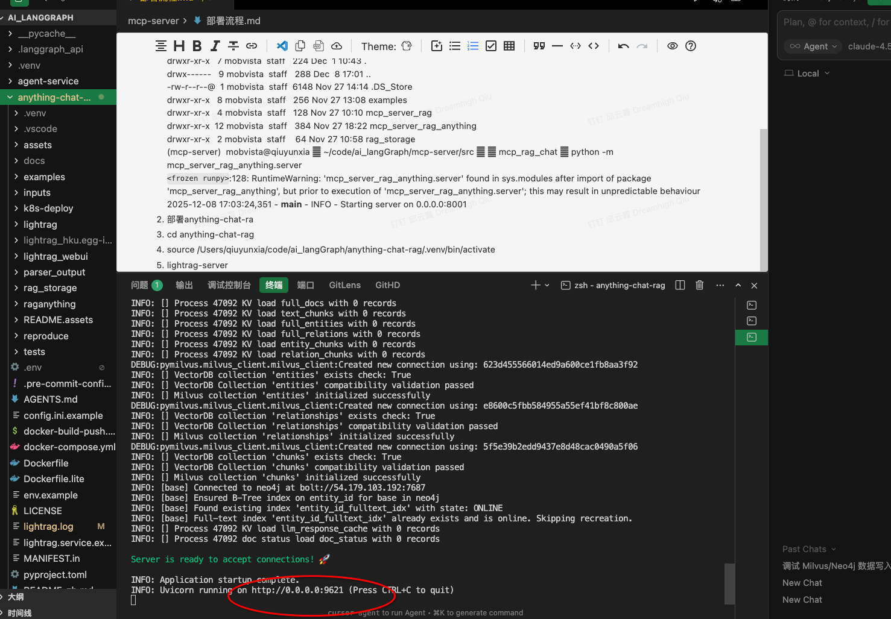

# 🚀 项目部署流程

本文档介绍如何部署完整的 RAG + Agent 服务栈。请按顺序启动以下服务。

---

## 📋 前置条件

- Python 3.11+
- Node.js 18+
- 各服务的 `.env` 配置文件已正确配置

---

## 1️⃣ MCP Server (RAG Anything)

**功能**: 提供 RAG 知识库的 MCP 服务接口

```bash
# 进入目录
cd mcp-server

# 激活虚拟环境
source .venv/bin/activate

# 启动服务
python -m mcp_server_rag_anything.server
```

| 项目     | 地址                          |
| -------- | ----------------------------- |
| 服务地址 | <br />`http://0.0.0.0:8000` |

访问接口文档：http://localhost:9621/docs

---

## 2️⃣ LightRAG Server (知识库服务)

**功能**: 提供 LightRAG 知识图谱和向量检索服务

```bash
# 进入目录
cd anything-chat-rag

# 激活虚拟环境
source .venv/bin/activate

# 启动服务
lightrag-server
```

| 项目     | 地址                      |
| -------- | ------------------------- |
| API 服务 | `http://localhost:9621` |

**界面预览**:



---

## 3️⃣ Deep Agents Service (Agent 服务)

**功能**: 提供 LangGraph Agent 服务，支持 Performance Agent 和 Research Agent

```bash
# 进入目录
cd testing-deep-agents-service

# 激活虚拟环境
source .venv/bin/activate

# 启动服务
python start_server.py
```

| 项目      | 地址                           |
| --------- | ------------------------------ |
| API 服务  | `http://localhost:2025`      |
| API 文档  | `http://localhost:2025/docs` |
| Studio UI | `http://localhost:2025/ui`   |
| 健康检查  | `http://localhost:2025/ok`   |

---

## 4️⃣ 前端服务 (Testing Deep Agents UI)

**功能**: 提供可视化交互界面

```bash
# 进入目录
cd testing-deep-agents-ui

# 安装依赖 (首次运行)
npm install

# 启动开发服务器
npm run dev
```

| 项目     | 地址                      |
| -------- | ------------------------- |
| 前端页面 | `http://localhost:3000` |

---

## 🔗 服务依赖关系

```
┌─────────────────┐
│   Frontend UI   │  ← 用户访问入口
│  localhost:3000 │
└────────┬────────┘
         │
         ▼
┌─────────────────┐
│  Agent Service  │  ← 核心 Agent 服务
│  localhost:2025 │
└────────┬────────┘
         │
    ┌────┴────┐
    ▼         ▼
┌────────┐  ┌──────────┐
│MCP Srv │  │ LightRAG │  ← 知识库服务
│ :8000  │  │  :9621   │
└────────┘  └──────────┘
```

---

## ⚠️ 常见问题

### 1. Pydantic Settings 验证错误

如果启动 Agent Service 时出现 `Extra inputs are not permitted` 错误，请在 `src/core/config.py` 的 `Settings.Config` 中添加：

```python
extra = "ignore"
```

### 2. 端口被占用

```bash
# 查找占用端口的进程
lsof -i :端口号

# 终止进程
kill -9 进程ID
```

---

## 📝 快速启动脚本

可以创建一个 `start_all.sh` 脚本一键启动所有服务：

```bash
#!/bin/bash

# 启动 MCP Server
osascript -e 'tell app "Terminal" to do script "cd ~/code/ai_langGraph/mcp-server && source .venv/bin/activate && python -m mcp_server_rag_anything.server"'

# 启动 LightRAG
osascript -e 'tell app "Terminal" to do script "cd ~/code/ai_langGraph/anything-chat-rag && source .venv/bin/activate && lightrag-server"'

# 启动 Agent Service
osascript -e 'tell app "Terminal" to do script "cd ~/code/ai_langGraph/testing-deep-agents-service && source .venv/bin/activate && python start_server.py"'

# 启动前端
osascript -e 'tell app "Terminal" to do script "cd ~/code/ai_langGraph/testing-deep-agents-ui && npm run dev"'

echo "✅ 所有服务已启动!"
```
