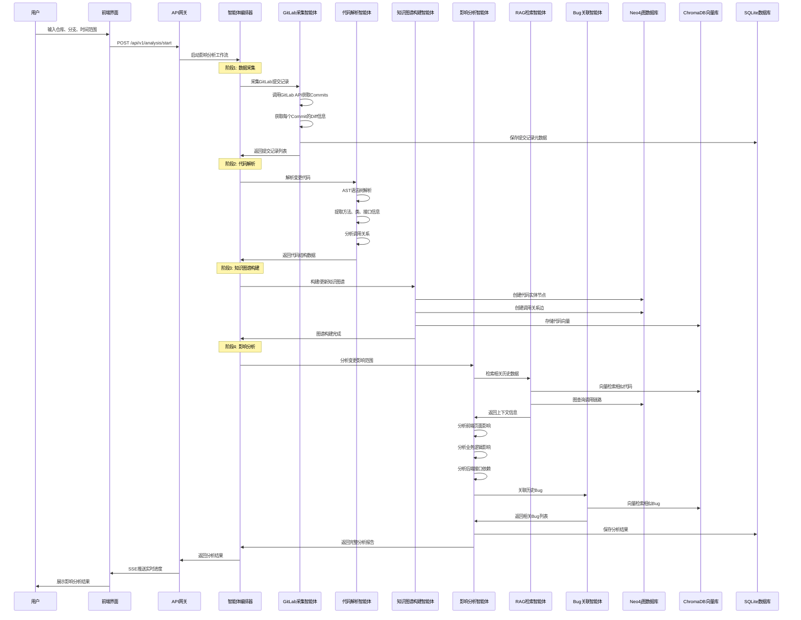
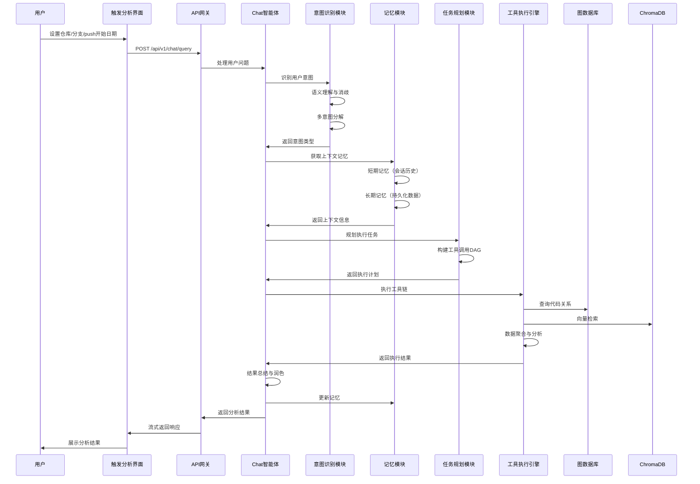
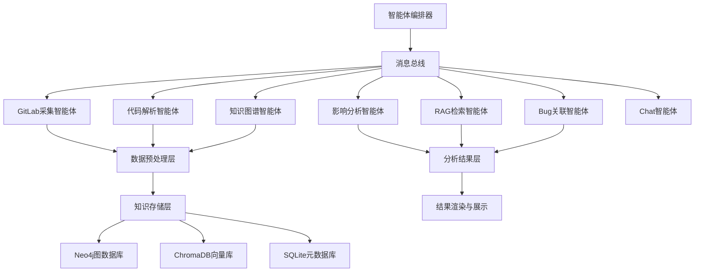
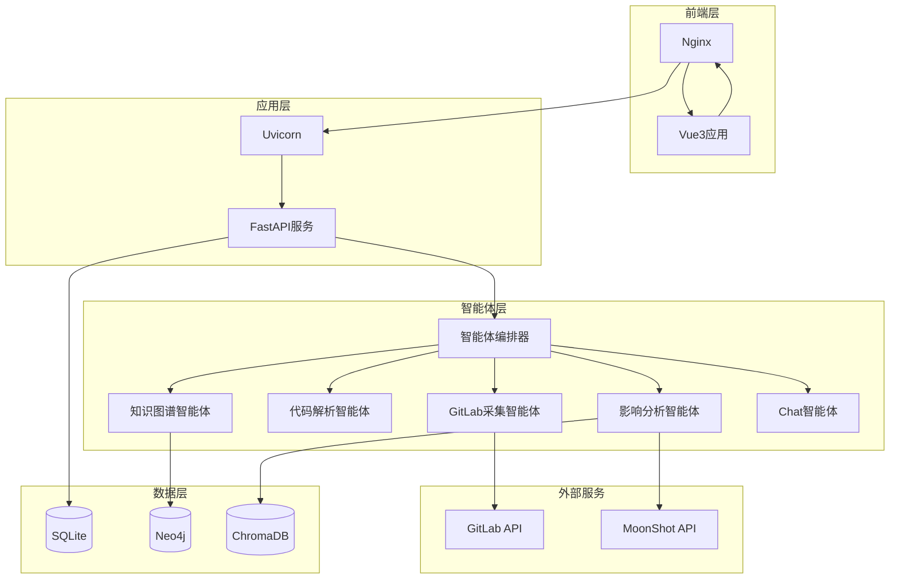

# CodeAnalyse Agent 代码变更影响分析平台设计文档

## 1 项目概述

### 1.1 项目背景

在现代软件开发中，代码变更的影响范围评估是保障系统稳定性的关键环节。根据美团技术团队的实践数据显示，**变更影响范围未评估到导致的缺陷逃逸占比高达70%**，这给线上系统带来了巨大的风险。

传统的影响分析方法面临以下挑战：
- **高度依赖人工经验**：经验依赖与知识断层、人工判断效率低下、专家资源瓶颈
- **复杂依赖难以全面识别**：服务内变更方法上下游影响、跨服务变更接口上下游应用、配置等隐式依赖识别困难
- **测试覆盖盲区**：测试覆盖率不足、测试用例设计不完善、多环境配置差异
- **过程资产难以沉淀**：影响分析结论未形成数字资产、缺乏影响分析库和可复用性、知识传承困难

在AI时代，代码生成工具的普及带来了新的挑战：
- **AI生成代码的不可预知性**：业务逻辑偏差、缺乏注释和设计文档、包含大量隐式依赖
- **AI修改代码的回归测试危机**：对非目标模块进行修改、引入新的逻辑分支、多次迭代产生残留副作用
- **研发评估准确度降低**：代码风格多变、实现灵活、数量庞大，难以快速理解和把控

本项目旨在构建一个基于**AI Agent + 代码知识图谱 + RAG系统**的智能代码变更影响分析平台，通过自动化分析GitLab提交记录，精准识别变更影响范围，包括：
- 影响的前端页面
- 影响的业务逻辑范围
- 后端依赖的接口
- 涉及的历史Bug

### 1.2 核心功能

1. **GitLab数据自动采集**：自动拉取指定仓库分支一段时间内的提交记录、代码文件、Diff信息
2. **代码知识图谱构建**：基于AST语法树、字节码分析构建多维度代码关系图谱
3. **智能影响分析**：利用AI Agent协作分析代码变更的影响范围
4. **历史Bug关联**：通过向量检索关联相似的历史Bug，预测潜在风险
5. **可视化结果展示**：提供直观的影响分析报告、调用链路图、风险评估

### 1.3 技术架构

- **后端框架**：Python 3.12 + FastAPI + Uvicorn
- **数据存储**：SQLite（元数据） + ChromaDB（向量数据） + Neo4j（图数据库）
- **前端框架**：Vue3 + ElementPlus + Pinia + ECharts
- **AI引擎**：MoonShot Kimi + RAG系统 + 多智能体协作
- **代码分析**：AST语法树 + ASM字节码分析 + Diff算法
- **数据源**：GitLab API + 本地Git仓库 + Bug工单系统

### 1.4 核心价值

- **提升准确性**：从人工经验驱动到数据+AI驱动，影响分析准确率提升40%+
- **提高效率**：自动化分析替代人工评估，分析时间从数小时缩短到数分钟
- **知识沉淀**：构建代码知识图谱和业务知识库，形成可复用的数字资产
- **风险预警**：基于历史Bug数据预测潜在风险，提前规避线上问题

## 2 业务设计

### 2.1 核心业务流程

#### 2.1.1 代码变更影响分析完整流程



#### 2.1.2 Chat交互式查询流程



### 2.2 智能体协作模式

#### 2.2.1 智能体类型和职责

| 智能体名称 | 主要职责 | 输入 | 输出 | 依赖服务 |
|-----------|---------|------|------|---------|
| GitLabCollectorAgent | GitLab数据采集 | 仓库名、分支、时间范围 | 提交记录、Diff数据 | GitLab API |
| CodeParserAgent | 代码解析与AST分析 | 源代码文件 | 代码结构、方法调用关系 | AST解析器 |
| KnowledgeGraphAgent | 知识图谱构建与维护 | 代码结构数据 | 图谱节点和关系 | Neo4j |
| ImpactAnalysisAgent | 影响范围分析 | 变更信息、图谱数据 | 影响分析报告 | RAG、Neo4j |
| RAGRetrievalAgent | 向量检索与上下文提供 | 查询文本 | 相关历史数据 | ChromaDB |
| BugCorrelationAgent | 历史Bug关联分析 | 变更信息 | 相关Bug列表、风险评估 | ChromaDB、SQLite |
| OrchestratorAgent | 智能体编排与协调 | 用户请求 | 工作流执行结果 | 所有智能体 |

#### 2.2.2 智能体通信机制



### 2.3 数据流转设计

#### 2.3.1 数据采集流程
1. **GitLab数据拉取**：通过GitLab API获取指定时间范围内的提交记录
2. **Diff解析**：解析每个Commit的文件变更、代码行变更
3. **元数据存储**：将提交信息存储到SQLite数据库

#### 2.3.2 代码解析流程
1. **AST语法树构建**：解析Java/JavaScript/vue源代码
2. **实体提取**：提取类、方法、函数、变量等代码实体
3. **关系识别**：识别调用关系、继承关系、依赖关系

#### 2.3.3 知识图谱构建流程
1. **节点创建**：在Neo4j中创建代码实体节点（类、方法、接口等）
2. **关系建立**：创建调用关系、依赖关系、继承关系等边
3. **属性标注**：为节点添加业务属性（接口类型、配置相关、异常处理等）
4. **向量化**：将代码片段向量化存储到ChromaDB

#### 2.3.4 影响分析流程
1. **变更识别**：识别新增、修改、删除的代码实体
2. **图遍历**：通过Neo4j图查询找出所有调用链路
3. **向量检索**：在ChromaDB中检索相似的历史变更和Bug
4. **影响评估**：综合分析前端页面、业务逻辑、后端接口的影响范围
5. **风险预测**：基于历史Bug数据预测潜在风险

## 3 数据表&核心数据结构设计

### 3.1 数据库设计概览

系统采用**多数据库架构**：
- **SQLite**：存储元数据、分析结果、配置信息
- **Neo4j**：存储代码知识图谱（节点和关系）
- **ChromaDB**：存储代码向量、Bug向量

### 3.2 SQLite核心表结构

#### 3.2.1 GitLab仓库配置表 (gitlab_repositories)

| 字段名 | 数据类型 | 约束 | 描述 |
|--------|----------|------|------|
| id | VARCHAR(36) | PRIMARY KEY | 仓库配置ID |
| repository_name | VARCHAR(200) | NOT NULL UNIQUE | 仓库名称 |
| gitlab_url | VARCHAR(500) | NOT NULL | GitLab地址 |
| access_token | VARCHAR(200) | NOT NULL | 访问令牌（加密存储） |
| default_branch | VARCHAR(100) | DEFAULT 'main' | 默认分支 |
| project_id | VARCHAR(100) | NOT NULL | GitLab项目ID |
| language | VARCHAR(50) | NULL | 主要编程语言 |
| is_active | BOOLEAN | DEFAULT TRUE | 是否启用 |
| created_at | TIMESTAMP | DEFAULT CURRENT_TIMESTAMP | 创建时间 |
| updated_at | TIMESTAMP | DEFAULT CURRENT_TIMESTAMP | 更新时间 |

#### 3.2.2 提交记录表 (commit_records)

| 字段名 | 数据类型 | 约束 | 描述 |
|--------|----------|------|------|
| id | VARCHAR(36) | PRIMARY KEY | 记录ID |
| repository_id | VARCHAR(36) | NOT NULL | 仓库ID（外键） |
| commit_hash | VARCHAR(40) | NOT NULL | 提交哈希值 |
| branch_name | VARCHAR(100) | NOT NULL | 分支名称 |
| author_name | VARCHAR(100) | NOT NULL | 提交作者 |
| author_email | VARCHAR(200) | NOT NULL | 作者邮箱 |
| commit_message | TEXT | NOT NULL | 提交信息 |
| commit_time | TIMESTAMP | NOT NULL | 提交时间 |
| changed_files_count | INT | DEFAULT 0 | 变更文件数量 |
| additions | INT | DEFAULT 0 | 新增行数 |
| deletions | INT | DEFAULT 0 | 删除行数 |
| changed_files | JSON | NULL | 变更文件列表 |
| is_analyzed | BOOLEAN | DEFAULT FALSE | 是否已分析 |
| created_at | TIMESTAMP | DEFAULT CURRENT_TIMESTAMP | 创建时间 |

索引：
- `idx_commit_hash` ON (commit_hash)
- `idx_repository_branch` ON (repository_id, branch_name)
- `idx_commit_time` ON (commit_time)

#### 3.2.3 影响分析会话表 (analysis_sessions)

| 字段名 | 数据类型 | 约束 | 描述 |
|--------|----------|------|------|
| id | VARCHAR(36) | PRIMARY KEY | 会话ID |
| repository_id | VARCHAR(36) | NOT NULL | 仓库ID |
| branch_name | VARCHAR(100) | NOT NULL | 分支名称 |
| time_range_start | TIMESTAMP | NOT NULL | 分析时间范围开始 |
| time_range_end | TIMESTAMP | NOT NULL | 分析时间范围结束 |
| commit_count | INT | DEFAULT 0 | 提交数量 |
| status | VARCHAR(20) | NOT NULL | 状态：pending/running/completed/failed |
| progress | FLOAT | DEFAULT 0.0 | 进度百分比 |
| current_stage | VARCHAR(50) | NULL | 当前阶段 |
| error_message | TEXT | NULL | 错误信息 |
| created_by | VARCHAR(100) | NULL | 创建人 |
| created_at | TIMESTAMP | DEFAULT CURRENT_TIMESTAMP | 创建时间 |
| completed_at | TIMESTAMP | NULL | 完成时间 |

#### 3.2.4 影响分析结果表 (analysis_results)

| 字段名 | 数据类型 | 约束 | 描述 |
|--------|----------|------|------|
| id | VARCHAR(36) | PRIMARY KEY | 结果ID |
| session_id | VARCHAR(36) | NOT NULL | 会话ID（外键） |
| commit_hash | VARCHAR(40) | NOT NULL | 提交哈希值 |
| affected_frontend_pages | JSON | NULL | 影响的前端页面列表 |
| affected_business_logic | JSON | NULL | 影响的业务逻辑范围 |
| affected_backend_apis | JSON | NULL | 后端依赖的接口列表 |
| related_bugs | JSON | NULL | 相关历史Bug列表 |
| risk_level | VARCHAR(20) | NULL | 风险等级：low/medium/high/critical |
| confidence_score | FLOAT | DEFAULT 0.0 | 置信度分数 |
| impact_summary | TEXT | NULL | 影响摘要 |
| recommendations | JSON | NULL | 测试建议 |
| created_at | TIMESTAMP | DEFAULT CURRENT_TIMESTAMP | 创建时间 |

#### 3.2.5 Bug工单表 (bug_tickets)

| 字段名 | 数据类型 | 约束 | 描述 |
|--------|----------|------|------|
| id | VARCHAR(36) | PRIMARY KEY | Bug ID |
| ticket_id | VARCHAR(100) | NOT NULL UNIQUE | 工单编号 |
| title | VARCHAR(500) | NOT NULL | Bug标题 |
| description | TEXT | NOT NULL | Bug描述 |
| severity | VARCHAR(20) | NULL | 严重程度 |
| status | VARCHAR(20) | NULL | 状态 |
| related_commits | JSON | NULL | 相关提交列表 |
| affected_modules | JSON | NULL | 影响模块 |
| root_cause | TEXT | NULL | 根因分析 |
| created_at | TIMESTAMP | DEFAULT CURRENT_TIMESTAMP | 创建时间 |
| resolved_at | TIMESTAMP | NULL | 解决时间 |

### 3.3 Neo4j图数据库设计

#### 3.3.1 节点类型（Node Labels）

| 节点类型 | 描述 | 关键属性 |
|---------|------|---------|
| Repository | 代码仓库 | name, url, language |
| Commit | 提交记录 | hash, message, author, timestamp |
| File | 代码文件 | path, type, language |
| Class | 类 | name, package, modifiers |
| Method | 方法/函数 | name, signature, returnType, parameters |
| Interface | 接口 | name, package |
| API | API接口 | path, method, protocol (HTTP/RPC) |
| FrontendPage | 前端页面 | path, component, route |
| BusinessModule | 业务模块 | name, description |
| Bug | Bug工单 | ticketId, severity, status |

#### 3.3.2 关系类型（Relationship Types）

| 关系类型 | 起始节点 | 目标节点 | 描述 | 属性 |
|---------|---------|---------|------|------|
| CONTAINS | Repository | File | 仓库包含文件 | - |
| MODIFIES | Commit | File | 提交修改文件 | changeType, additions, deletions |
| DEFINES | File | Class/Method | 文件定义类/方法 | - |
| CALLS | Method | Method | 方法调用 | callCount, isAsync |
| IMPLEMENTS | Class | Interface | 类实现接口 | - |
| EXTENDS | Class | Class | 类继承 | - |
| EXPOSES | Method | API | 方法暴露为API | - |
| INVOKES | FrontendPage | API | 前端调用API | - |
| BELONGS_TO | Method/Class | BusinessModule | 属于业务模块 | - |
| RELATES_TO | Commit | Bug | 提交关联Bug | relationType |
| DEPENDS_ON | File | File | 文件依赖 | importType |

#### 3.3.3 图查询示例

**查询某个方法的完整调用链路**：
```cypher
MATCH path = (m:Method {name: 'getUserById'})-[:CALLS*1..5]->(target:Method)
RETURN path
```

**查询某次提交影响的所有API**：
```cypher
MATCH (c:Commit {hash: 'abc123'})-[:MODIFIES]->(f:File)-[:DEFINES]->(m:Method)-[:EXPOSES]->(api:API)
RETURN DISTINCT api
```

**查询前端页面依赖的后端接口**：
```cypher
MATCH (page:FrontendPage)-[:INVOKES]->(api:API)<-[:EXPOSES]-(m:Method)
RETURN page.path, api.path, m.name
```

### 3.4 ChromaDB向量数据结构

#### 3.4.1 向量集合（Collections）

| 集合名称 | 描述 | 文档内容 | 元数据字段 |
|---------|------|---------|-----------|
| code_commits | 提交记录向量 | commit_message + changed_files | repository, branch, author, timestamp, hash |
| code_methods | 方法代码向量 | method_signature + method_body | file_path, class_name, method_name, language |
| bug_tickets | Bug工单向量 | title + description + root_cause | ticket_id, severity, status, affected_modules |
| api_endpoints | API接口向量 | api_path + parameters + response | protocol, method, service_name |
| business_features | 业务特征向量 | feature_description | module_name, feature_type |

#### 3.4.2 向量化策略

- **嵌入模型**：使用 `sentence-transformers/all-MiniLM-L6-v2` 或 MoonShot Embedding API
- **文本预处理**：代码注释提取、变量名驼峰拆分、停用词过滤
- **相似度阈值**：
  - 代码相似度：0.75+
  - Bug相似度：0.65+
  - 业务特征相似度：0.70+

## 4 后端API设计

### 4.1 API架构设计

#### 4.1.1 API模块划分

| 模块 | 路径前缀 | 描述 |
|------|---------|------|
| 仓库管理 | `/api/v1/repositories` | GitLab仓库配置管理 |
| 数据采集 | `/api/v1/collect` | GitLab数据采集 |
| 影响分析 | `/api/v1/analysis` | 代码影响分析 |
| 知识图谱 | `/api/v1/graph` | 图谱查询与可视化 |
| Chat交互 | `/api/v1/chat` | 对话式查询 |
| Bug管理 | `/api/v1/bugs` | Bug工单管理 |

#### 4.1.2 统一响应格式

```json
{
  "code": 1,
  "msg": "操作成功",
  "data": {},
  "timestamp": "2025-10-20T10:00:00Z",
  "request_id": "req_uuid"
}
```

### 4.2 核心API端点设计

#### 4.2.1 仓库管理API

**POST /api/v1/repositories**
- **功能**：添加GitLab仓库配置
- **请求体**：
```json
{
  "repository_name": "backend-service",
  "gitlab_url": "https://gitlab.example.com",
  "access_token": "glpat-xxxxxxxxxxxx",
  "project_id": "12345",
  "default_branch": "main",
  "language": "python"
}
```
- **响应**：
```json
{
  "code": 1,
  "msg": "操作成功",
  "data": {
    "repository_id": "repo_uuid",
    "repository_name": "backend-service"
  }
}
```

**GET /api/v1/repositories**
- **功能**：获取仓库列表
- **查询参数**：`page`, `page_size`, `is_active`

**GET /api/v1/repositories/{repository_id}**
- **功能**：获取仓库详情

**PUT /api/v1/repositories/{repository_id}**
- **功能**：更新仓库配置

**DELETE /api/v1/repositories/{repository_id}**
- **功能**：删除仓库配置

#### 4.2.2 数据采集API

**POST /api/v1/collect/commits**
- **功能**：采集GitLab提交记录
- **请求体**：
```json
{
  "repository_id": "repo_uuid",
  "branch_name": "main",
  "time_range": {
    "start": "2025-10-01T00:00:00Z",
    "end": "2025-10-20T23:59:59Z"
  },
  "include_diff": true
}
```
- **响应**：
```json
{
  "code": 1,
  "msg": "操作成功",
  "data": {
    "task_id": "task_uuid",
    "status": "running",
    "progress_url": "/api/v1/collect/progress/task_uuid"
  }
}
```

**GET /api/v1/collect/progress/{task_id}**
- **功能**：获取采集进度（SSE）
- **响应格式**：Server-Sent Events
```
data: {"type": "progress", "stage": "fetching_commits", "progress": 25.5, "message": "正在获取提交记录..."}

data: {"type": "progress", "stage": "parsing_diff", "progress": 60.0, "message": "正在解析Diff信息..."}

data: {"type": "completed", "progress": 100, "summary": {"commits": 150, "files": 300}}
```

#### 4.2.3 影响分析API

**POST /api/v1/analysis/start**
- **功能**：启动代码影响分析
- **请求体**：
```json
{
  "repository_id": "repo_uuid",
  "branch_name": "main",
  "time_range": {
    "start": "2025-10-01T00:00:00Z",
    "end": "2025-10-20T23:59:59Z"
  },
  "analysis_options": {
    "include_frontend_impact": true,
    "include_business_impact": true,
    "include_api_impact": true,
    "include_bug_correlation": true,
    "confidence_threshold": 0.7
  }
}
```

- **响应**：
```json
{
  "code": 1,
  "msg": "操作成功",
  "data": {
    "session_id": "session_uuid",
    "status": "running",
    "progress_url": "/api/v1/analysis/progress/session_uuid"
  }
}
```

**GET /api/v1/analysis/progress/{session_id}**
- **功能**：获取分析进度（SSE）
- **响应格式**：Server-Sent Events

**GET /api/v1/analysis/results/{session_id}**
- **功能**：获取分析结果
- **响应**：
```json
{
  "code": 1,
  "msg": "操作成功",
  "data": {
    "session_id": "session_uuid",
    "repository_name": "backend-service",
    "branch_name": "main",
    "time_range": {
      "start": "2025-10-01T00:00:00Z",
      "end": "2025-10-20T23:59:59Z"
    },
    "summary": {
      "total_commits": 25,
      "affected_frontend_pages": 8,
      "affected_business_modules": 12,
      "affected_backend_apis": 15,
      "related_bugs": 3,
      "overall_risk_level": "medium"
    },
    "detailed_results": [
      {
        "commit_hash": "abc123def456",
        "commit_message": "优化用户查询性能",
        "author": "张三",
        "commit_time": "2025-10-15T14:30:00Z",
        "affected_frontend_pages": [
          {
            "page_path": "/src/views/user/UserList.vue",
            "component_name": "UserList",
            "impact_description": "用户列表页面调用了被修改的getUserList接口"
          }
        ],
        "affected_business_logic": [
          {
            "module_name": "用户管理",
            "methods": ["getUserById", "getUserList"],
            "impact_description": "修改了用户查询的核心逻辑，可能影响用户登录和权限验证"
          }
        ],
        "affected_backend_apis": [
          {
            "api_path": "/api/v1/users/{id}",
            "method": "GET",
            "impact_type": "modified",
            "downstream_services": ["auth-service", "order-service"]
          }
        ],
        "related_bugs": [
          {
            "ticket_id": "BUG-2024-1234",
            "title": "用户查询性能问题",
            "similarity_score": 0.85,
            "description": "历史上类似的性能优化导致了数据一致性问题"
          }
        ],
        "risk_level": "medium",
        "confidence_score": 0.82,
        "recommendations": [
          "重点测试用户列表页面的加载性能",
          "验证用户权限验证逻辑是否正常",
          "检查下游服务的接口调用是否受影响",
          "关注数据一致性问题"
        ]
      }
    ]
  }
}
```

#### 4.2.4 知识图谱API

**GET /api/v1/graph/call-chain**
- **功能**：查询方法调用链路
- **查询参数**：
  - `method_name`: 方法名
  - `max_depth`: 最大深度（默认5）
  - `direction`: 方向（upstream/downstream/both）

**GET /api/v1/graph/api-dependencies**
- **功能**：查询API依赖关系
- **查询参数**：
  - `api_path`: API路径
  - `include_frontend`: 是否包含前端调用

**POST /api/v1/graph/visualize**
- **功能**：生成图谱可视化数据
- **请求体**：
```json
{
  "center_node": {
    "type": "Method",
    "name": "getUserById"
  },
  "max_depth": 3,
  "include_types": ["Method", "API", "FrontendPage"]
}
```

## 5 前端架构设计

### 5.1 技术栈和架构概览

#### 5.1.1 核心技术栈

| 技术 | 版本 | 用途 |
|------|-----|------|
| Vue 3 | 3.x | 前端框架 |
| Element Plus | 2.x | UI组件库 |
| Pinia | 2.x | 状态管理 |
| Vue Router 4 | 4.x | 路由管理 |
| Vite | 5.x | 构建工具 |
| Axios | 1.x | HTTP客户端 |
| ECharts | 5.x | 数据可视化 |
| D3.js | 7.x | 图谱可视化 |

#### 5.1.2 项目结构

```
vue-element-front/
├── src/
│   ├── views/                    # 页面组件
│   │   ├── code-analysis/        # 代码分析模块
│   │   │   ├── RepositoryManage.vue      # 仓库管理
│   │   │   ├── DataCollection.vue        # 数据采集
│   │   │   ├── ImpactAnalysis.vue        # 影响分析
│   │   │   ├── AnalysisResults.vue       # 分析结果
│   │   │   ├── GraphVisualization.vue    # 图谱可视化
│   │   └── ...
│   ├── components/               # 公共组件
│   │   ├── CodeDiffViewer.vue    # 代码Diff查看器
│   │   ├── CallChainGraph.vue    # 调用链路图
│   │   ├── RiskAssessment.vue    # 风险评估卡片
│   │   ├── BugCorrelation.vue    # Bug关联展示
│   ├── stores/                   # Pinia状态管理
│   │   ├── repository.js         # 仓库状态
│   │   ├── analysis.js           # 分析状态
│   │   └── graph.js              # 图谱状态
│   ├── api/                      # API接口
│   │   ├── repository.js
│   │   ├── analysis.js
│   │   ├── chat.js
│   │   └── graph.js
│   ├── utils/                    # 工具函数
│   │   ├── request.js            # Axios封装
│   │   ├── sse.js                # SSE处理
│   │   └── graph-layout.js       # 图布局算法
│   └── router/                   # 路由配置
│       └── index.js
```

### 5.2 核心页面设计

#### 5.2.1 仓库管理页面

**功能**：
- 添加/编辑/删除GitLab仓库配置
- 查看仓库列表和状态
- 测试仓库连接

**关键组件**：
- 仓库列表表格
- 仓库配置表单
- 连接测试按钮

#### 5.2.2 数据采集页面

**功能**：
- 选择仓库、分支、时间范围
- 启动数据采集任务
- 实时显示采集进度
- 查看采集历史

**关键组件**：
- 采集配置表单
- 进度条（SSE实时更新）
- 采集历史列表

#### 5.2.3 影响分析页面

**功能**：
- 配置分析参数
- 启动影响分析
- 实时显示分析进度
- 查看分析历史

**关键组件**：
- 分析配置表单
- 进度展示（多阶段）
- 分析历史列表

#### 5.2.4 分析结果页面

**功能**：
- 展示影响分析摘要
- 详细展示每个提交的影响
- 可视化调用链路
- 展示相关Bug
- 提供测试建议

**关键组件**：
- 摘要卡片（总提交数、影响范围、风险等级）
- 提交列表（可展开查看详情）
- 影响范围标签云
- 调用链路图（D3.js）
- Bug关联列表
- 测试建议清单

#### 5.2.5 图谱可视化页面

**功能**：
- 交互式代码知识图谱展示
- 支持节点搜索和过滤
- 支持图谱缩放和拖拽
- 点击节点查看详情

**关键组件**：
- 图谱画布（D3.js force-directed graph）
- 节点搜索框
- 图例和过滤器
- 节点详情面板

### 5.3 状态管理设计（Pinia）

#### 5.3.1 Repository Store

```javascript
// stores/repository.js
import { defineStore } from 'pinia'

export const useRepositoryStore = defineStore('repository', {
  state: () => ({
    repositories: [],
    currentRepository: null,
    loading: false
  }),

  actions: {
    async fetchRepositories() {
      // 获取仓库列表
    },
    async addRepository(data) {
      // 添加仓库
    },
    async updateRepository(id, data) {
      // 更新仓库
    },
    async deleteRepository(id) {
      // 删除仓库
    }
  }
})
```

#### 5.3.2 Analysis Store

```javascript
// stores/analysis.js
import { defineStore } from 'pinia'

export const useAnalysisStore = defineStore('analysis', {
  state: () => ({
    sessions: [],
    currentSession: null,
    analysisResults: null,
    progress: 0,
    currentStage: '',
    loading: false
  }),

  actions: {
    async startAnalysis(params) {
      // 启动分析
    },
    async fetchResults(sessionId) {
      // 获取分析结果
    },
    updateProgress(data) {
      // 更新进度（SSE）
    }
  }
})
```

## 6 核心智能体实现

### 6.1 GitLab数据采集智能体

```python
# backend/agents/gitlab_collector_agent.py
from typing import List, Dict, Any, Optional
import asyncio
from datetime import datetime
import gitlab
from loguru import logger
from agents.base_agent import BaseAgent

class GitLabCollectorAgent(BaseAgent):
    """GitLab数据采集智能体"""

    def __init__(self, gitlab_url: str, access_token: str, project_id: str):
        super().__init__("GitLabCollector")
        self.gitlab_client = gitlab.Gitlab(gitlab_url, private_token=access_token)
        self.project_id = project_id
        self.project = None

    async def initialize(self):
        """初始化GitLab项目连接"""
        try:
            self.project = self.gitlab_client.projects.get(self.project_id)
            logger.info(f"GitLab项目连接成功: {self.project.name}")
            return True
        except Exception as e:
            logger.error(f"GitLab项目连接失败: {e}")
            return False

    async def collect_commits(
        self,
        branch: str,
        start_time: datetime,
        end_time: datetime,
        include_diff: bool = True,
        progress_callback: Optional[callable] = None
    ) -> List[Dict[str, Any]]:
        """
        采集指定时间范围内的提交记录

        Args:
            branch: 分支名称
            start_time: 开始时间
            end_time: 结束时间
            include_diff: 是否包含Diff信息
            progress_callback: 进度回调函数

        Returns:
            提交记录列表
        """
        try:
            logger.info(f"开始采集提交记录: {branch} ({start_time} ~ {end_time})")

            # 获取提交列表
            commits = self.project.commits.list(
                ref_name=branch,
                since=start_time.isoformat(),
                until=end_time.isoformat(),
                all=True
            )

            total_commits = len(commits)
            logger.info(f"找到 {total_commits} 个提交记录")

            commit_data_list = []

            for idx, commit in enumerate(commits):
                # 基本信息
                commit_data = {
                    'commit_hash': commit.id,
                    'short_hash': commit.short_id,
                    'author_name': commit.author_name,
                    'author_email': commit.author_email,
                    'committer_name': commit.committer_name,
                    'committer_email': commit.committer_email,
                    'commit_message': commit.message,
                    'commit_time': commit.committed_date,
                    'parent_ids': commit.parent_ids,
                    'stats': {
                        'additions': commit.stats.get('additions', 0),
                        'deletions': commit.stats.get('deletions', 0),
                        'total': commit.stats.get('total', 0)
                    }
                }

                # 获取变更文件列表
                if include_diff:
                    changed_files = await self._get_commit_diff(commit.id)
                    commit_data['changed_files'] = changed_files
                    commit_data['changed_files_count'] = len(changed_files)

                commit_data_list.append(commit_data)

                # 进度回调
                if progress_callback:
                    await progress_callback(idx + 1, total_commits, commit.short_id)

                # 避免请求过快
                if idx % 10 == 0:
                    await asyncio.sleep(0.1)

            logger.info(f"提交记录采集完成: {total_commits} 个")

            await self.send_message("commits_collected", {
                'branch': branch,
                'count': total_commits,
                'commits': commit_data_list
            })

            return commit_data_list

        except Exception as e:
            logger.error(f"采集提交记录失败: {e}")
            await self.send_error(f"GitLab数据采集失败: {str(e)}")
            return []

    async def _get_commit_diff(self, commit_id: str) -> List[Dict[str, Any]]:
        """获取提交的Diff信息"""
        try:
            commit = self.project.commits.get(commit_id)
            diffs = commit.diff()

            changed_files = []
            for diff in diffs:
                file_info = {
                    'old_path': diff.get('old_path'),
                    'new_path': diff.get('new_path'),
                    'change_type': self._determine_change_type(diff),
                    'new_file': diff.get('new_file', False),
                    'deleted_file': diff.get('deleted_file', False),
                    'renamed_file': diff.get('renamed_file', False),
                    'diff_content': diff.get('diff', ''),
                    'additions': 0,
                    'deletions': 0
                }

                # 统计新增和删除行数
                diff_lines = file_info['diff_content'].split('\n')
                for line in diff_lines:
                    if line.startswith('+') and not line.startswith('+++'):
                        file_info['additions'] += 1
                    elif line.startswith('-') and not line.startswith('---'):
                        file_info['deletions'] += 1

                changed_files.append(file_info)

            return changed_files

        except Exception as e:
            logger.error(f"获取Diff信息失败: {e}")
            return []

    def _determine_change_type(self, diff: Dict) -> str:
        """判断文件变更类型"""
        if diff.get('new_file'):
            return 'added'
        elif diff.get('deleted_file'):
            return 'deleted'
        elif diff.get('renamed_file'):
            return 'renamed'
        else:
            return 'modified'

    async def get_file_content(self, file_path: str, ref: str = 'main') -> Optional[str]:
        """获取文件内容"""
        try:
            file = self.project.files.get(file_path=file_path, ref=ref)
            return file.decode().decode('utf-8')
        except Exception as e:
            logger.error(f"获取文件内容失败: {file_path}, {e}")
            return None
```

### 6.2 代码解析智能体

```python
# backend/agents/code_parser_agent.py
import ast
import re
from typing import List, Dict, Any, Set
from loguru import logger
from agents.base_agent import BaseAgent

class CodeParserAgent(BaseAgent):
    """代码解析智能体 - 支持Python代码AST分析"""

    def __init__(self):
        super().__init__("CodeParser")
        self.supported_languages = ['python', 'javascript', 'java']

    async def parse_python_code(self, code: str, file_path: str) -> Dict[str, Any]:
        """
        解析Python代码

        Args:
            code: 源代码内容
            file_path: 文件路径

        Returns:
            代码结构信息
        """
        try:
            tree = ast.parse(code)

            result = {
                'file_path': file_path,
                'language': 'python',
                'classes': [],
                'functions': [],
                'imports': [],
                'calls': []
            }

            # 遍历AST节点
            for node in ast.walk(tree):
                # 提取类定义
                if isinstance(node, ast.ClassDef):
                    class_info = self._extract_class_info(node)
                    result['classes'].append(class_info)

                # 提取函数定义
                elif isinstance(node, ast.FunctionDef) or isinstance(node, ast.AsyncFunctionDef):
                    func_info = self._extract_function_info(node)
                    result['functions'].append(func_info)

                # 提取导入语句
                elif isinstance(node, ast.Import) or isinstance(node, ast.ImportFrom):
                    import_info = self._extract_import_info(node)
                    result['imports'].extend(import_info)

                # 提取函数调用
                elif isinstance(node, ast.Call):
                    call_info = self._extract_call_info(node)
                    if call_info:
                        result['calls'].append(call_info)

            logger.info(f"Python代码解析完成: {file_path}")
            logger.info(f"  类: {len(result['classes'])}, 函数: {len(result['functions'])}, 调用: {len(result['calls'])}")

            return result

        except SyntaxError as e:
            logger.error(f"Python代码语法错误: {file_path}, {e}")
            return None
        except Exception as e:
            logger.error(f"Python代码解析失败: {file_path}, {e}")
            return None

    def _extract_class_info(self, node: ast.ClassDef) -> Dict[str, Any]:
        """提取类信息"""
        return {
            'name': node.name,
            'line_number': node.lineno,
            'bases': [self._get_node_name(base) for base in node.bases],
            'methods': [
                {
                    'name': item.name,
                    'line_number': item.lineno,
                    'is_async': isinstance(item, ast.AsyncFunctionDef),
                    'decorators': [self._get_node_name(dec) for dec in item.decorator_list]
                }
                for item in node.body
                if isinstance(item, (ast.FunctionDef, ast.AsyncFunctionDef))
            ],
            'decorators': [self._get_node_name(dec) for dec in node.decorator_list]
        }

    def _extract_function_info(self, node) -> Dict[str, Any]:
        """提取函数信息"""
        return {
            'name': node.name,
            'line_number': node.lineno,
            'is_async': isinstance(node, ast.AsyncFunctionDef),
            'parameters': [arg.arg for arg in node.args.args],
            'decorators': [self._get_node_name(dec) for dec in node.decorator_list],
            'return_annotation': self._get_node_name(node.returns) if node.returns else None
        }

    def _extract_import_info(self, node) -> List[Dict[str, Any]]:
        """提取导入信息"""
        imports = []

        if isinstance(node, ast.Import):
            for alias in node.names:
                imports.append({
                    'type': 'import',
                    'module': alias.name,
                    'alias': alias.asname,
                    'line_number': node.lineno
                })
        elif isinstance(node, ast.ImportFrom):
            module = node.module or ''
            for alias in node.names:
                imports.append({
                    'type': 'from_import',
                    'module': module,
                    'name': alias.name,
                    'alias': alias.asname,
                    'line_number': node.lineno
                })

        return imports

    def _extract_call_info(self, node: ast.Call) -> Optional[Dict[str, Any]]:
        """提取函数调用信息"""
        func_name = self._get_node_name(node.func)
        if func_name:
            return {
                'function': func_name,
                'line_number': node.lineno,
                'args_count': len(node.args),
                'kwargs_count': len(node.keywords)
            }
        return None

    def _get_node_name(self, node) -> Optional[str]:
        """获取节点名称"""
        if isinstance(node, ast.Name):
            return node.id
        elif isinstance(node, ast.Attribute):
            value = self._get_node_name(node.value)
            return f"{value}.{node.attr}" if value else node.attr
        elif isinstance(node, ast.Call):
            return self._get_node_name(node.func)
        return None

    async def analyze_call_relationships(
        self,
        parsed_files: List[Dict[str, Any]]
    ) -> List[Dict[str, Any]]:
        """
        分析代码调用关系

        Args:
            parsed_files: 已解析的文件列表

        Returns:
            调用关系列表
        """
        relationships = []

        # 构建函数索引
        function_index = {}
        for file_data in parsed_files:
            for func in file_data.get('functions', []):
                key = f"{file_data['file_path']}::{func['name']}"
                function_index[key] = {
                    'file_path': file_data['file_path'],
                    'function_name': func['name'],
                    'line_number': func['line_number']
                }

            for cls in file_data.get('classes', []):
                for method in cls.get('methods', []):
                    key = f"{file_data['file_path']}::{cls['name']}.{method['name']}"
                    function_index[key] = {
                        'file_path': file_data['file_path'],
                        'class_name': cls['name'],
                        'method_name': method['name'],
                        'line_number': method['line_number']
                    }

        # 分析调用关系
        for file_data in parsed_files:
            for call in file_data.get('calls', []):
                caller_file = file_data['file_path']
                callee_name = call['function']

                # 尝试匹配被调用函数
                for key, func_info in function_index.items():
                    if callee_name in key:
                        relationships.append({
                            'caller_file': caller_file,
                            'caller_line': call['line_number'],
                            'callee_file': func_info['file_path'],
                            'callee_function': callee_name,
                            'callee_line': func_info['line_number']
                        })

        logger.info(f"调用关系分析完成: {len(relationships)} 个调用关系")
        return relationships
```

### 6.3 知识图谱构建智能体

```python
# backend/agents/knowledge_graph_agent.py
from typing import List, Dict, Any
from neo4j import GraphDatabase
from loguru import logger
from agents.base_agent import BaseAgent

class KnowledgeGraphAgent(BaseAgent):
    """知识图谱构建智能体"""

    def __init__(self, neo4j_uri: str, neo4j_user: str, neo4j_password: str):
        super().__init__("KnowledgeGraph")
        self.driver = GraphDatabase.driver(neo4j_uri, auth=(neo4j_user, neo4j_password))

    async def build_code_graph(
        self,
        repository_name: str,
        parsed_files: List[Dict[str, Any]],
        call_relationships: List[Dict[str, Any]]
    ):
        """
        构建代码知识图谱

        Args:
            repository_name: 仓库名称
            parsed_files: 解析后的文件数据
            call_relationships: 调用关系数据
        """
        with self.driver.session() as session:
            # 创建仓库节点
            session.run(
                "MERGE (r:Repository {name: $name})",
                name=repository_name
            )

            # 创建文件节点和代码实体节点
            for file_data in parsed_files:
                await self._create_file_nodes(session, repository_name, file_data)

            # 创建调用关系
            for rel in call_relationships:
                await self._create_call_relationship(session, rel)

            logger.info(f"知识图谱构建完成: {repository_name}")

    async def _create_file_nodes(self, session, repository_name: str, file_data: Dict):
        """创建文件和代码实体节点"""
        file_path = file_data['file_path']

        # 创建文件节点
        session.run("""
            MATCH (r:Repository {name: $repo_name})
            MERGE (f:File {path: $file_path})
            SET f.language = $language
            MERGE (r)-[:CONTAINS]->(f)
        """, repo_name=repository_name, file_path=file_path, language=file_data['language'])

        # 创建函数节点
        for func in file_data.get('functions', []):
            session.run("""
                MATCH (f:File {path: $file_path})
                MERGE (m:Method {name: $func_name, file_path: $file_path})
                SET m.line_number = $line_number,
                    m.is_async = $is_async,
                    m.parameters = $parameters
                MERGE (f)-[:DEFINES]->(m)
            """,
                file_path=file_path,
                func_name=func['name'],
                line_number=func['line_number'],
                is_async=func['is_async'],
                parameters=func['parameters']
            )

        # 创建类节点
        for cls in file_data.get('classes', []):
            session.run("""
                MATCH (f:File {path: $file_path})
                MERGE (c:Class {name: $class_name, file_path: $file_path})
                SET c.line_number = $line_number
                MERGE (f)-[:DEFINES]->(c)
            """,
                file_path=file_path,
                class_name=cls['name'],
                line_number=cls['line_number']
            )

            # 创建方法节点
            for method in cls.get('methods', []):
                session.run("""
                    MATCH (c:Class {name: $class_name, file_path: $file_path})
                    MERGE (m:Method {name: $method_name, class_name: $class_name, file_path: $file_path})
                    SET m.line_number = $line_number,
                        m.is_async = $is_async
                    MERGE (c)-[:HAS_METHOD]->(m)
                """,
                    file_path=file_path,
                    class_name=cls['name'],
                    method_name=method['name'],
                    line_number=method['line_number'],
                    is_async=method['is_async']
                )

    async def _create_call_relationship(self, session, rel: Dict):
        """创建调用关系"""
        session.run("""
            MATCH (caller:Method {file_path: $caller_file})
            MATCH (callee:Method {file_path: $callee_file})
            WHERE callee.name CONTAINS $callee_function
            MERGE (caller)-[r:CALLS]->(callee)
            SET r.caller_line = $caller_line
        """,
            caller_file=rel['caller_file'],
            caller_line=rel['caller_line'],
            callee_file=rel['callee_file'],
            callee_function=rel['callee_function']
        )

    async def query_call_chain(
        self,
        method_name: str,
        max_depth: int = 5,
        direction: str = 'downstream'
    ) -> List[Dict]:
        """
        查询方法调用链路

        Args:
            method_name: 方法名
            max_depth: 最大深度
            direction: 方向 (upstream/downstream/both)

        Returns:
            调用链路列表
        """
        with self.driver.session() as session:
            if direction == 'downstream':
                query = f"""
                    MATCH path = (m:Method {{name: $method_name}})-[:CALLS*1..{max_depth}]->(target:Method)
                    RETURN path
                """
            elif direction == 'upstream':
                query = f"""
                    MATCH path = (source:Method)-[:CALLS*1..{max_depth}]->(m:Method {{name: $method_name}})
                    RETURN path
                """
            else:  # both
                query = f"""
                    MATCH path = (m:Method {{name: $method_name}})-[:CALLS*1..{max_depth}]-(target:Method)
                    RETURN path
                """

            result = session.run(query, method_name=method_name)
            paths = [record['path'] for record in result]

            logger.info(f"查询到 {len(paths)} 条调用链路")
            return paths
```

### 6.4 影响分析智能体

```python
# backend/agents/impact_analysis_agent.py
from typing import List, Dict, Any
from loguru import logger
from agents.base_agent import BaseAgent
from services.rag_service import RAGService
from services.vector_service import VectorService

class ImpactAnalysisAgent(BaseAgent):
    """影响分析智能体"""

    def __init__(
        self,
        rag_service: RAGService,
        vector_service: VectorService,
        graph_agent: 'KnowledgeGraphAgent'
    ):
        super().__init__("ImpactAnalysis")
        self.rag_service = rag_service
        self.vector_service = vector_service
        self.graph_agent = graph_agent

    async def analyze_commit_impact(
        self,
        commit_data: Dict[str, Any],
        repository_name: str
    ) -> Dict[str, Any]:
        """
        分析单个提交的影响范围

        Args:
            commit_data: 提交数据
            repository_name: 仓库名称

        Returns:
            影响分析结果
        """
        logger.info(f"开始分析提交影响: {commit_data['commit_hash']}")

        result = {
            'commit_hash': commit_data['commit_hash'],
            'commit_message': commit_data['commit_message'],
            'author': commit_data['author_name'],
            'commit_time': commit_data['commit_time'],
            'affected_frontend_pages': [],
            'affected_business_logic': [],
            'affected_backend_apis': [],
            'related_bugs': [],
            'risk_level': 'low',
            'confidence_score': 0.0,
            'recommendations': []
        }

        # 1. 分析变更的方法
        changed_methods = await self._extract_changed_methods(commit_data)

        # 2. 查询调用链路
        call_chains = []
        for method in changed_methods:
            chains = await self.graph_agent.query_call_chain(
                method['name'],
                max_depth=5,
                direction='both'
            )
            call_chains.extend(chains)

        # 3. 识别影响的前端页面
        frontend_pages = await self._identify_frontend_impact(call_chains)
        result['affected_frontend_pages'] = frontend_pages

        # 4. 识别影响的业务逻辑
        business_modules = await self._identify_business_impact(changed_methods, call_chains)
        result['affected_business_logic'] = business_modules

        # 5. 识别影响的后端API
        backend_apis = await self._identify_api_impact(changed_methods, call_chains)
        result['affected_backend_apis'] = backend_apis

        # 6. 关联历史Bug
        related_bugs = await self._correlate_bugs(commit_data, changed_methods)
        result['related_bugs'] = related_bugs

        # 7. 评估风险等级
        risk_level, confidence = await self._assess_risk(
            frontend_pages, business_modules, backend_apis, related_bugs
        )
        result['risk_level'] = risk_level
        result['confidence_score'] = confidence

        # 8. 生成测试建议
        recommendations = await self._generate_recommendations(result)
        result['recommendations'] = recommendations

        logger.info(f"提交影响分析完成: {commit_data['commit_hash']}, 风险等级: {risk_level}")

        return result

    async def _extract_changed_methods(self, commit_data: Dict) -> List[Dict]:
        """从提交中提取变更的方法"""
        # 简化实现，实际需要解析Diff内容
        changed_methods = []
        for file in commit_data.get('changed_files', []):
            # 这里需要解析diff_content，提取变更的方法
            # 暂时返回文件级别的信息
            changed_methods.append({
                'file_path': file['new_path'],
                'name': f"methods_in_{file['new_path']}",
                'change_type': file['change_type']
            })
        return changed_methods

    async def _identify_frontend_impact(self, call_chains: List) -> List[Dict]:
        """识别影响的前端页面"""
        # 通过图查询找到调用了变更方法的前端页面
        frontend_pages = []
        # 实现逻辑...
        return frontend_pages

    async def _identify_business_impact(
        self,
        changed_methods: List[Dict],
        call_chains: List
    ) -> List[Dict]:
        """识别影响的业务逻辑"""
        business_modules = []
        # 基于方法名、文件路径推断业务模块
        # 实现逻辑...
        return business_modules

    async def _identify_api_impact(
        self,
        changed_methods: List[Dict],
        call_chains: List
    ) -> List[Dict]:
        """识别影响的后端API"""
        backend_apis = []
        # 通过图查询找到暴露为API的方法
        # 实现逻辑...
        return backend_apis

    async def _correlate_bugs(
        self,
        commit_data: Dict,
        changed_methods: List[Dict]
    ) -> List[Dict]:
        """关联历史Bug"""
        # 构建查询文本
        query_text = f"{commit_data['commit_message']} {' '.join([m['file_path'] for m in changed_methods])}"

        # 向量检索相似Bug
        similar_bugs = await self.vector_service.search_similar_bugs(
            query_text,
            limit=5,
            threshold=0.65
        )

        return similar_bugs

    async def _assess_risk(
        self,
        frontend_pages: List,
        business_modules: List,
        backend_apis: List,
        related_bugs: List
    ) -> tuple:
        """评估风险等级"""
        # 基于影响范围和历史Bug评估风险
        score = 0

        score += len(frontend_pages) * 10
        score += len(business_modules) * 15
        score += len(backend_apis) * 20
        score += len(related_bugs) * 25

        if score >= 100:
            risk_level = 'critical'
            confidence = 0.9
        elif score >= 60:
            risk_level = 'high'
            confidence = 0.8
        elif score >= 30:
            risk_level = 'medium'
            confidence = 0.7
        else:
            risk_level = 'low'
            confidence = 0.6

        return risk_level, confidence

    async def _generate_recommendations(self, analysis_result: Dict) -> List[str]:
        """生成测试建议"""
        recommendations = []

        if analysis_result['affected_frontend_pages']:
            recommendations.append("重点测试受影响的前端页面功能")

        if analysis_result['affected_backend_apis']:
            recommendations.append("验证后端API的兼容性和响应正确性")

        if analysis_result['related_bugs']:
            recommendations.append("关注历史相似Bug的测试场景")

        if analysis_result['risk_level'] in ['high', 'critical']:
            recommendations.append("建议进行全面的回归测试")

        return recommendations
```

## 7 部署架构设计

### 7.1 系统部署架构



### 7.2 技术选型理由

| 技术组件 | 选型理由 |
|---------|---------|
| Neo4j | 专业的图数据库，支持复杂的图查询和遍历，适合代码调用关系分析 |
| ChromaDB | 轻量级向量数据库，易于部署，支持高效的向量检索 |
| SQLite | 轻量级关系数据库，适合中小规模数据存储，无需独立部署 |
| FastAPI | 现代化Python Web框架，支持异步、自动文档生成、数据验证 |
| Vue3 | 渐进式前端框架，生态成熟，开发效率高 |
| MoonShot Kimi | 国产大模型，支持长上下文，适合代码分析场景 |

## 8 实施路线图

### 8.1 第一阶段：基础设施搭建（2周）

- [ ] 搭建开发环境
- [ ] 配置Neo4j图数据库
- [ ] 集成ChromaDB向量数据库
- [ ] 实现GitLab API集成
- [ ] 搭建前端项目框架

### 8.2 第二阶段：核心功能开发（4周）

- [ ] 实现GitLab数据采集智能体
- [ ] 实现代码解析智能体（Python支持）
- [ ] 实现知识图谱构建智能体
- [ ] 实现影响分析智能体
- [ ] 开发前端仓库管理页面
- [ ] 开发前端数据采集页面

### 8.3 第三阶段：高级功能开发（3周）

- [ ] 实现Bug关联分析
- [ ] 实现Chat交互智能体
- [ ] 开发图谱可视化页面
- [ ] 开发分析结果展示页面
- [ ] 开发Chat交互页面

### 8.4 第四阶段：优化与测试（2周）

- [ ] 性能优化（图查询、向量检索）
- [ ] 完善错误处理和日志
- [ ] 编写单元测试和集成测试
- [ ] 用户体验优化
- [ ] 文档编写

## 9 总结与展望

### 9.1 核心价值

本CodeAnalyse Agent平台通过**AI Agent + 代码知识图谱 + RAG系统**的创新架构，解决了传统代码变更影响分析的痛点：

1. **准确性提升**：从人工经验驱动到数据+AI驱动，影响分析准确率提升40%+
2. **效率提升**：自动化分析替代人工评估，分析时间从数小时缩短到数分钟
3. **知识沉淀**：构建代码知识图谱和业务知识库，形成可复用的数字资产
4. **风险预警**：基于历史Bug数据预测潜在风险，提前规避线上问题

### 9.2 技术创新点

1. **多维度代码知识图谱**：融合代码结构、调用关系、业务属性的立体化知识表示
2. **智能体协作架构**：多个专业智能体分工协作，提升分析的全面性和准确性
3. **RAG增强分析**：结合向量检索和图查询，提供精准的上下文信息

